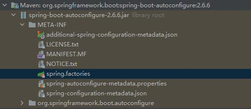

# 1、控制台的初始密码{noop}是如何产生的？

​	初始密码是如何产生的，和前面的过滤器链一样，肯定不能凭空产生，也是由`Spring Boot`自动装配产生的。我们在`spring.factories`中找到名为`UserDetailsServiceAutoConfiguration`，如下所示。

```java
@Configuration(proxyBeanMethods = false)
@ConditionalOnClass(AuthenticationManager.class)
@ConditionalOnBean(ObjectPostProcessor.class)
@ConditionalOnMissingBean(
		value = { AuthenticationManager.class, AuthenticationProvider.class, UserDetailsService.class,
				AuthenticationManagerResolver.class },
		type = { "org.springframework.security.oauth2.jwt.JwtDecoder",
				"org.springframework.security.oauth2.server.resource.introspection.OpaqueTokenIntrospector",
				"org.springframework.security.oauth2.client.registration.ClientRegistrationRepository" })
public class UserDetailsServiceAutoConfiguration {

    // 明文密码前缀，数据库中直接存储明文
	private static final String NOOP_PASSWORD_PREFIX = "{noop}";

    // 密码加密算法正则表达式
	private static final Pattern PASSWORD_ALGORITHM_PATTERN = Pattern.compile("^\\{.+}.*$");

	private static final Log logger = LogFactory.getLog(UserDetailsServiceAutoConfiguration.class);

	@Bean
	@Lazy
	public InMemoryUserDetailsManager inMemoryUserDetailsManager(SecurityProperties properties,
			ObjectProvider<PasswordEncoder> passwordEncoder) {
        // 从SecurityProperties获取用户信息，这意味着我们可以直接在application.yml中配置用户信息
		SecurityProperties.User user = properties.getUser();
		List<String> roles = user.getRoles();
		return new InMemoryUserDetailsManager(
				User.withUsername(user.getName()).password(getOrDeducePassword(user, passwordEncoder.getIfAvailable()))
						.roles(StringUtils.toStringArray(roles)).build());
	}

	private String getOrDeducePassword(SecurityProperties.User user, PasswordEncoder encoder) {
		String password = user.getPassword();
        // 将生成的初始密码打印在控制台
		if (user.isPasswordGenerated()) {
			logger.warn(String.format(
					"%n%nUsing generated security password: %s%n%nThis generated password is for development use only. "
							+ "Your security configuration must be updated before running your application in "
							+ "production.%n",
					user.getPassword()));
		}
        // 如果我们指定了PasswordEncoder，存储的密码就不会指定前缀，注意：指定了PasswordEncoder后，密码一定也要以这种方式存储
		if (encoder != null || PASSWORD_ALGORITHM_PATTERN.matcher(password).matches()) {
			return password;
		}
        // 存储明文密码，加上指定前缀
		return NOOP_PASSWORD_PREFIX + password;
	}
}
```

# 2、刚刚集成时是如何跳转到登录页的？

# 3、过滤器链是如何产生的？

​	前面讲完了`Spring Security`的默认认证和授权流程，现在就来填一下前面的坑，讨论一下过滤器链是如何产生的，以及过滤器链中一些重要过滤器的作用。我们都知道`Spring Boot`的厉害之处，就在于它的自动装配，那么这过滤器链不可能凭空产生，肯定是由`Spring Boot`自动装配产生的。首先，我们找到自动装配的配置文件`spring.factories`，如下图所示。



​	在`spring.factories`中找到名为`SecurityAutoConfiguration`的配置类，这就是`Spring Security`的自动配置类。


​	我们可以看到这个自动配置类生效的条件是类加载路径下存在名为`DefaultAuthenticationEventPublisher`的类，这个毋庸置疑，肯定是成立的，当我们引入依赖的那一刻，这个类就存在了。下面我们重点关注`@Import`导入的两个配置类，`SpringBootWebSecurityConfiguration`和`WebSecurityEnablerConfiguration`，这两个类至关重要。

## 4.1 SpringBootWebSecurityConfiguration

​	首先，我们看到这个名为`SpringBootWebSecurityConfiguration`的配置类，如下图所示。


​	我们看到这个配置类的注释，其大概意思是说这个配置类是web安全的默认配置，如果用户配置了自己的`WebSecurityConfigurerAdapter`或`SecurityFilterChain` bean，这个配置类就不会生效，那么这解释了为什么我们集成`Spring Security`时要自己写一个类继承`WebSecurityConfigurerAdapter`作为`Spring Security`的配置类。我们可以看到在这个配置类中只有一个名为`defaultSecurityFilterChain`的bean，这个bean的类型就是`SecurityFilterChain`，是不是很熟悉？没错，这就是`Spring Security`为我们配置的默认`FilterChain`，这也是我们前面为什么会用那段代码获取所有的`Filter`。这时可能有人就会问了，前面的代码不是`DefaultSecurityFilterChain`吗？事实上，只要我们进入`http.build()`一探究竟，就会发现`DefaultSecurityFilterChain`就是`SecurityFilterChain`的实现类，而这个方法所需要的参数是一个`HttpSecurity`对象，而这个参数会由其它配置类产生自动注入到这里。

​	我们可以看到这个配置类生效的条件是使用默认的`WebSecurity`配置，且当前的应用程序是一个web应用程序，我们进入`@ConditionalOnDefaultWebSecurity`，如下图所示。


​	然后我们进入`DefaultWebSecurityCondition`，如下图所示。


​	我们可以看到`SpringBootWebSecurityConfiguration`生效的条件就在这个类里面，即类加载路径下有`SecurityFilterChain`和`HttpSecurity`这两个类，且容器中不存在类型为`WebSecurityConfigurerAdapter`和`SecurityFilterChain`的bean，我们在集成`Spring Security`时，什么都没配置，容器中肯定是不会存在这两个bean的。

## 4.2 WebSecurityEnablerConfiguration

​	接下来，看到名为`WebSecurityEnablerConfiguration`的配置类，如下图所示。


​	首先看到这个配置类的注释，其大概意思是说，这个配置类的目的是确保引入注解`@EnableWebSecurity`，如果用户自己添加了该注解或者容器中已经存在名为`springSecurityFilterChain`的bean，那么这个配置类就不会生效。一句话，这个配置类的目的就是引入注解`@EnableWebSecurity`，所以，这个注解才是关键。

​	接下来，我们进入`@EnableWebSecurity`，如下图所示。


​	我们重点关注`@Import`导入的两个配置类，`WebSecurityConfiguration`和`HttpSecurityConfiguration`，这两个类至关重要。

### 4.2.1 WebSecurityConfiguration

​	`WebSecurityConfiguration`，顾名思义，就是`WebSecurity`的配置类，至于这个`WebSecurity`是什么？有什么作用？我们后面再做详细讨论。首先我们看到`WebSecurityConfiguration`的注释，如下图所示。


​	这个注释的大概意思是说这个配置类的作用是使用`WebSecurity`创建一个`FilterChainProxy`，而`FilterChainProxy`与Web安全至关重要，至于这个`FilterChainProxy`是什么？有什么作用？这个我们后面再做详细讨论，现在只需知道前面的`SecurityFilterChain`是由它管理的。注释后面还说我们可以通过继承`WebSecurityConfigurerAdapter`或是实现`WebSecurityConfigurer`的方式对`WebSecurity`进行个性化配置，欸！这里又提到了`WebSecurityConfigurerAdapter`，说明`WebSecurityConfigurerAdapter`在`Spring Security`中如此重要，至于它和`WebSecurity`是什么关系，我们后面再做详细讨论。

​	我们看到创建`FilterChainProxy`的方法，如下图所示。


​	首先看到方法的注释，方法的注释说这个方法返回的是一个代表`SecurityFilterChain`的`Filter`，哦！原来`FilterChainProxy`也是一个`Filter`呀！而且它还管理着`SecurityFilterChain`。再看这个方法产生的`Bean`的名字是`springSecurityFilterChain`，也就是到时可以通过这个名字获取`FilterChainProxy`。再看这个方法的前面三句，前面有个断言，大概意思是说，`WebSecurityConfigurerAdapter`和`SecurityFilterChain`只能存在其一，而这个`SecurityFilterChain`可由前面的`SpringBootWebSecurityConfiguration`产生，在这个方法下面就有一个`set`方法将容器中的所有`SecurityFilterChain`注入到这个配置类中，为什么这两个只能存在一个呢？这两者之间又是什么关系呢？这个我们后文再做讨论。继续往后看，如果这两个都没有的话，`Spring Security`还贴心的为我们添加了一个`WebSecurityConfigurerAdapter`，将`WebSecurityConfigurerAdapter`添加到`WebSecurity`，如果存在`SecurityFilterChain`的话，还将为`WebSecurity`添加一个`SecurityFilterChainBuilder`，然后遍历所有的`WebSecurityCustomizer`对`WebSecurity`进行个性化配置，最后调用`WebSecurity`的`build`方法来创建`FilterChainProxy`。看来`WebSecurity`创建`FilterChainProxy`需要一个`WebSecurityConfigurerAdapter`或`SecurityFilterChain`，那么这个`WebSecurity`从何而来，接下来看到这个配置类的另一个方法`setFilterChainProxySecurityConfigurer`，如下图所示。


​	我们可以看到这个方法需要两个参数：`ObjectPostProcessor`和`List<SecurityConfigurer<Filter, WebSecurity>>`。首先说一下这两个参数从何而来，还记得前面的注解`@EnableWebSecurity`吗？`ObjectPostProcessor`就是由`@EnableWebSecurity`上面另一个注解`@EnableGlobalAuthentication`产生的，至于这个`ObjectPostProcessor`的具体作用，现在我们不去过多深究，只需要知道它会对创建的对象做一些增强的逻辑；再看到另一个参数，这个参数需要容器中所有`SecurityConfigurer<Filter, WebSecurity>`的实现类(实际上前面的注解限制了为`SecurityConfigurer`的子接口`WebSecurityConfigurer`的实现类)，而`WebSecurityConfigurerAdapter`就是其中的一个实现类。这个方法的主要作用就是创建`WebSecurity`，然后获取容器中的所有`WebSecurityConfigurer`，为其`configurers`赋值(即调用`WebSecurity`的`apply`方法)。

### 4.2.2 HttpSecurityConfiguration

​	接下来看到`HttpSecurityConfiguration`，首先看到这个配置类的注释，如下图所示。


​	从注释可以看出，这个配置类的主要作用就是创建`HttpSecurity`，这个`HttpSecurity`是什么，有什么作用，相信配置过`WebSecurityConfigurerAdapter`的并不陌生，这个`HttpSecurity`有什么作用？与`WebSecurity`又有什么关系？我们后面再做详细讨论，下面看到创建`HttpSecurity`的方法。


​	注意看，这个Bean是多例的，并不是单例的，也就是说这个Bean并不会提前产生，只会在需要用到的时候产生。还记得前面的`SpringBootWebSecurityConfiguration`吗？那里就需要一个`HttpSecurity`，这里就是`Spring Security`做的一系列默认配置，可以看到已经添加了两个`Filter`，其它的都使用了默认的配置。

## 4.3 FilterChainProxy

​	说到`FilterChainProxy`，就不得不提到`Spring Security`的整体架构，`FilterChainProxy`在`Spring Security`中扮演者极其重要的角色，具体可以参阅`Spring Security`的官网(https://docs.spring.io/spring-security/reference/5.7/servlet/architecture.html)。

​	首先来看下面这张图。


​	官网对这张图的解释是：

​	Spring provides a `Filter` implementation named [`DelegatingFilterProxy`](https://docs.spring.io/spring-framework/docs/5.3.28/javadoc-api/org/springframework/web/filter/DelegatingFilterProxy.html) that allows bridging between the Servlet container’s lifecycle and Spring’s `ApplicationContext`. The Servlet container allows registering `Filter`s using its own standards, but it is not aware of Spring defined Beans. `DelegatingFilterProxy` can be registered via standard Servlet container mechanisms, but delegate all the work to a Spring Bean that implements `Filter`.

​	我们都知道服务器在启动后会在`Servlet`容器中注册一系列`Filter`在请求到达服务器时，会经过这些`Filter`，而`Servlet`容器并不知道`Spring Security`中的`Filter`，因为这些`Filter`都在`Spring`的`ApplicationContext`中，为了能让`Spring Security`中的`Filter`处理请求，就设计了一个`DelegatingFilterProxy`，将其注册到`Servlet`容器中，负责拦截请求，并将所有的工作委派给`Spring Security`中的`Filter`，但是`Spring Security`中的`Filter`数量众多，这时就需要一个`FilterChain`，即前面`SpringBootWebSecurityConfiguration`创建的`SecurityFilterChain`，而`SecurityFilterChain`就是由`HttpSecurity`创建的。这是就需要引出我们的主角了：`FilterChainProxy`，咦！怎么是`FilterChainProxy`？不是`SecurityFilterChain`吗？别急，看下面这两张图.。

          

​	从图中可以看出`DelegatingFilterProxy`中的`delegate`就是`FilterChainProxy`，而`FilterChainProxy`中管理着一系列`SecurityFilterChain`，`SecurityFilterChain`中又管理着一系列`Filter`，这些`Filter`正是`Spring`的`ApplicationContext`中的`Filter`，为什么`FilterChainProxy`要管理着众多`SecurityFilterChain`呢？看右边的图就知道了，不同`SecurityFilterChain`针对不同的路径，也就是说我们可以在项目中根据不同的路径配置不同的`SecurityFilterChain`，不同的路径具有不同的校验规则，而`FilterChainProxy`会根据不同的路径选取不同的`SecurityFilterChain`。

## 4.4 总结

​	相信前面讲了那么多，大家都已经绕晕了吧，别急，我们先来捋捋这个过程。

​	首先，既然我们要实现认证和授权，那就需要`Filter`，而这些一个`Filter`又无法搞定，需要很多的`Filter`，不同的`Filter`各司其职，共同完成认证和授权，保护我们的Web应用程序。那么，如何让这些`Filter`协调起来，有效工作呢？没错，此时就需要`FilterChain`(即**SecurityFilterChain**)。但是，我们如果想要更加精细化的配置，让不同的路径具有的校验规则，怎么办呢？这时就需要多个`SecurityFilterChain`，不同的`SecurityFilterChain`针对不同的路径。

​	其次，当请求到达服务器时，怎么多的`SecurityFilterChain`，该用哪一个呢，那肯定的做出决策呀！这时，就需要**FilterChainProxy**，让它来管理众多的`SecurityFilterChain`，根据不同的请求路径使用不同的`SecurityFilterChain`。

​	最后，我们有这么多`Filter`，有用吗？没用啊！为什么没用？因为`Servlet`容器不知道啊，那么怎样才能让`Servlet`容器知道呢？那就弄个**DelegatingFilterProxy**，将它注册到`Servlet`容器，让它将请求传递给我们的`FilterChainProxy`，这样我们创建的那些`Filter`就可以正常工作了。

​	那么，，`Spring Security`整这么麻烦干什么呢？直接将那些`Filter`注册到`Servlet`容器不更香吗？这个问题就留给各位自己思考了。

# 4、过滤器链中的每个过滤器有何作用？

# 5、为什么要继承``WebSecurityConfigurerAdapter``?

# 6、Spring Boot如何集成Spring Security?

1、IDEA中新建一个Spring Boot工程

2、引入依赖

```xml
<dependencies>
    <!-- Spring Web相关依赖 -->
    <dependency>
        <groupId>org.springframework.boot</groupId>
        <artifactId>spring-boot-starter-web</artifactId>
    </dependency>

    <!-- Spring Security相关依赖 -->
    <dependency>
        <groupId>org.springframework.boot</groupId>
        <artifactId>spring-boot-starter-security</artifactId>
    </dependency>
</dependencies>
```

3、编写一个简单的``Controller``

```java
@RestController
@RequestMapping("/hello")
public class HelloController {

    @GetMapping("/helloWorld")
    public String helloWorld() {
        return "Hello World!";
    }
}
```

4、启动项目，在浏览器的地址栏输入`http://localhost:8080/hello/helloWorld`，此时会出现如何如下登录页


5、输入默认的用户名``user``和密码(``idea``控制台会打印出默认密码，如下图所示)，登录成功，浏览器页面成功展示出"Hello World!" 


​	以上便是Spring Boot集成Spring Security的基本流程，那么我们访问``HelloController``时，浏览器为何会跳转到登录页？默认用户名为什么是``user``？控制台的初始密码是如何打印出来的？

# 7、Spring Security的默认认证和授权流程？

​	首先说一下的浏览器为何会跳转到登录页，打开浏览器的开发者工具可以看到我们的请求被重定向到了`http://localhost:8080/login`。


​	为什么我们的请求会被重定向呢？肯定是我们没有通过认证呀，一定是在没有通过`Spring Security`的认证的情况下，`Spring Security`拦截了我们请求之后，将请求重定向到了默认登录页，当然这只是猜测，具体为什么会跳转到默认登录页，还需要我们了解`Spring Security`的认证和授权流程。既然前面都已经提到拦截请求了，那什么能拦截我们的请求呢，那肯定是``Filter``呀！对，你没猜错，`Spring Security`的认证和授权就是通过一系列`Filter`实现的，即`FilterChain`，当我们集成`Spring Security`时，`Spring security`就为我们配置了默认的`FilterChain`，其中包含15个`Filter`，可以可以通过下面的代码查看15个`Filter`，具体这15个`Filter`从何而来，我们会在后面进行讨论。

```java
@SpringBootApplication
public class SpringSecurityApplication {
    public static void main(String[] args) throws ClassNotFoundException {
        ConfigurableApplicationContext applicationContext = SpringApplication.run(SpringSecurityApplication.class, args);
        DefaultSecurityFilterChain defaultSecurityFilterChain = applicationContext.getBean(DefaultSecurityFilterChain.class);
        List<Filter> filters = defaultSecurityFilterChain.getFilters();
        for (int i = 0; i < filters.size(); i++) {
            System.out.println((i + 1) + ": " + filters.get(i));
        }
    }
}
```


​	默认情况下，当我们访问`HelloController`，我们请求会经过上图所示的15个`Filter`，啊！怎么会有这么多`Filter`？`Spring Security`怎么如此复杂，既然`Spring Secuity`是认证和授权框架，那么我们只要着重研究与认证和授权有关的Filter就行，那么，是哪个`Filter`呢？对，你没看错，就是那个`UsernamePasswordAuthenticationFilter`，见名知意，一看这个`Filter`就是用来进行认证的。既然是`UsernamePasswordAuthenticationFilter`，那肯定是将用户输入的用户名和密码与服务器存储的用户名和密码进行比对，一致就认证通过，不一致就认证失败，至于这个密码怎么存储，存储在什么地方，我们后面再进行讨论。认证通过之后就进行授权，那么授权又是哪一个`Filter`完成的呢，可能看名字看不出来，其实就是最后一个`FilterSecurityInterceptor`，咦？怎么就这个不叫`Filter`，叫`Interceptor`，那是因为请求到达接口之前要进行拦截，判断本次请求是否有权限访问接口。

## 7.1 认证

​	`UsernamePasswordAuthenticationFilter`的大致认证流程如下图所示。


* `AbstractAuthenticationProcessingFilter`：基于浏览器的http认证请求的抽象处理器。该过滤器有一个`authenticationManager`属性。具体的认证流程交给`AuthenticationManager`进行处理。该过滤器还有一个`requiresAuthenticationRequestMatcher`，如果请求与`matcher`匹配，该过滤器将拦截请求并尝试从该请求执行身份验证，身份验证由`attemptAuthentication`方法执行，该方法必须由子类实现。
* `UsernamePasswordAuthenticationFilter`：对表单提交的用户名和密码进行认证。
* `Authentication`：封装了当前待认证的用户信息，和认证通过后的用户信息，最常见的实现类是`UsernamePasswordAuthenticationToken`。
* `AuthenticationManager`：只有一个抽象方法`Authentication authenticate(Authentication authentication)`，其实现类需要重写该方法，所有的认证流程都在该方法中，`ProviderManager`是其最常见的实现类。
* `AbstractUserDetailsAuthenticationProvider`：`AuthenticationProvider`的实现类，而`AbstractUserDetailsAuthenticationProvider`是使用`UserDetail`对象进行认证的，认证时需要一个`Authentication`对象，认证成功后返回一个`Authentication`对象。该类主要用于响应`UsernamePasswordAuthenticationToken`身份验证请求。不同的`AuthenticationProvider`在认证时所需要的`Authentication`对象是不同的。
* `AuthenticationProvider`：具有`Authentication authenticate(Authentication authentication)`和`boolean supports(Class<?> authentication)`两个抽象方法，具体的认证逻辑由不同的实现类提供，不同的实现类认证不同`Authentication`对象，方法`supports`用于判定该实现类是否支持对应的`Authentication`。
* `UserDetailsService`：用于获取服务器存储的用户信息的核心接口，只有一个抽象方法`UserDetails loadUserByUsername(String username)`。
* `UserDetails`：封装服务器存储的用户信息。

### 7.1.1 UsernamePasswordAuthenticationFilter

​	可能直接看认证流程图比较抽象，下面就结合具体代码来理解上面的认证流程，代码里面还有很多细节，首先是`UsernamePasswordAuthenticationFilter`的父类`AbstractAuthenticationProcessingFilter`如下所示。

```java
public abstract class AbstractAuthenticationProcessingFilter extends GenericFilterBean
        implements ApplicationEventPublisherAware, MessageSourceAware {

    protected ApplicationEventPublisher eventPublisher;
    
    /**
     * 用于请求认证
     */
    private AuthenticationManager authenticationManager;

    private RememberMeServices rememberMeServices = new NullRememberMeServices();

    /**
     * 用于判断当前请求是否需要认证
     */
    private RequestMatcher requiresAuthenticationRequestMatcher;

    /**
     * 认证成功后是否要继续执行过滤器链
     */
    private boolean continueChainBeforeSuccessfulAuthentication = false;

    /**
     * 认证成功后的session处理策略
     */
    private SessionAuthenticationStrategy sessionStrategy = new NullAuthenticatedSessionStrategy();
    
    /**
     * 用于处理认证成功后相关事宜
     */
    private AuthenticationSuccessHandler successHandler = new SavedRequestAwareAuthenticationSuccessHandler();

    /**
     * 用于处理认证失败后相关事宜
     */
    private AuthenticationFailureHandler failureHandler = new SimpleUrlAuthenticationFailureHandler();

    /**
     * @param defaultFilterProcessesUrl 当前Filter要进行认证的url，实际就是为属性requiresAuthenticationRequestMatcher赋值
     */
    protected AbstractAuthenticationProcessingFilter(String defaultFilterProcessesUrl) {
        setFilterProcessesUrl(defaultFilterProcessesUrl);
    }

    /**
     * @param requiresAuthenticationRequestMatcher 用于判断当前请求是否需要认证
     */
    protected AbstractAuthenticationProcessingFilter(RequestMatcher requiresAuthenticationRequestMatcher) {
        Assert.notNull(requiresAuthenticationRequestMatcher, "requiresAuthenticationRequestMatcher cannot be null");
        this.requiresAuthenticationRequestMatcher = requiresAuthenticationRequestMatcher;
    }

    /**
     * @param defaultFilterProcessesUrl 当前Filter要进行认证的url
     * @param authenticationManager 用于请求认证
     */
    protected AbstractAuthenticationProcessingFilter(String defaultFilterProcessesUrl,
                                                     AuthenticationManager authenticationManager) {
        setFilterProcessesUrl(defaultFilterProcessesUrl);
        setAuthenticationManager(authenticationManager);
    }

    /**
     * @param requiresAuthenticationRequestMatcher 用于判断当前请求是否需要认证
     * @param authenticationManager 用于请求认证
     */
    protected AbstractAuthenticationProcessingFilter(RequestMatcher requiresAuthenticationRequestMatcher,
                                                     AuthenticationManager authenticationManager) {
        setRequiresAuthenticationRequestMatcher(requiresAuthenticationRequestMatcher);
        setAuthenticationManager(authenticationManager);
    }

    @Override
    public void doFilter(ServletRequest request, ServletResponse response, FilterChain chain)
            throws IOException, ServletException {
        doFilter((HttpServletRequest) request, (HttpServletResponse) response, chain);
    }

    /**
     * 调用requiresAuthentication方法来确定请求是否用于身份验证，是否应该由此过滤器处理。
     * 如果是身份验证请求，则调用attemptAuthentication来执行身份验证。有三种可能的结果:
     *  1.返回一个Authentication对象。配置的SessionAuthenticationStrategy将被调用，
     *    然后调用successfulAuthentication方法
     *  2.认证过程中出现异常。将调用unsuccessfulAuthentication方法
     *  3.返回Null，表示认证过程未完成
     */
    private void doFilter(HttpServletRequest request, HttpServletResponse response, FilterChain chain)
            throws IOException, ServletException {

        // 判断本次请求是否需要认证，每次会话认证只需要进行一次，认证成功后，以后的请求都不需要认证
        if (!requiresAuthentication(request, response)) {
            chain.doFilter(request, response);
            return;
        }
        try {
            // 进行认证，具体的认证流程由子类实现
            Authentication authenticationResult = attemptAuthentication(request, response);
            if (authenticationResult == null) {
                // return immediately as subclass has indicated that it hasn't completed
                return;
            }
            // 认证成功后的session处理策略
            this.sessionStrategy.onAuthentication(authenticationResult, request, response);
            // Authentication success
            if (this.continueChainBeforeSuccessfulAuthentication) {
                chain.doFilter(request, response);
            }
            // 认证成功后的处理策略
            successfulAuthentication(request, response, chain, authenticationResult);
        }
        catch (InternalAuthenticationServiceException failed) {
            this.logger.error("An internal error occurred while trying to authenticate the user.", failed);
            // 认证失败后的处理策略
            unsuccessfulAuthentication(request, response, failed);
        }
        catch (AuthenticationException ex) {
            // 认证失败后的处理策略
            unsuccessfulAuthentication(request, response, ex);
        }
    }

    /**
     * 判断当前的请求是否需要进行认证
     * @return 需要认证就返回ture，不需要认证就返回false
     */
    protected boolean requiresAuthentication(HttpServletRequest request, HttpServletResponse response) {
        if (this.requiresAuthenticationRequestMatcher.matches(request)) {
            return true;
        }
        if (this.logger.isTraceEnabled()) {
            this.logger
                    .trace(LogMessage.format("Did not match request to %s", this.requiresAuthenticationRequestMatcher));
        }
        return false;
    }

    /**
     * 用于执行具体的认证流程，由子类进行实现
     * @return 经过身份验证的用户令牌，如果身份验证不完整，则为空
     * @throws AuthenticationException 认证失败将抛出异常
     */
    public abstract Authentication attemptAuthentication(HttpServletRequest request, HttpServletResponse response)
            throws AuthenticationException, IOException, ServletException;

    /**
     * 认证成功后的处理策略，子类可以重写此方法，以便在身份验证成功后继续FilterChain。
     *  1.将认证成功后的用户信息存入SecurityContextHolder
     *  2.登录成功后通知已配置的RememberMeServices
     *  3.通过配置的ApplicationEventPublisher触发一个InteractiveAuthenticationSuccessEvent
     *  4.将其他行为委托给AuthenticationSuccessHandler
     * @param authResult 方法attemptAuthentication返回的经过身份验证的用户令牌
     */
    protected void successfulAuthentication(HttpServletRequest request, HttpServletResponse response, FilterChain chain,
                                            Authentication authResult) throws IOException, ServletException {
        SecurityContext context = SecurityContextHolder.createEmptyContext();
        context.setAuthentication(authResult);

        // 1.将认证成功后的用户信息存入SecurityContextHolder，
        SecurityContextHolder.setContext(context);
        if (this.logger.isDebugEnabled()) {
            this.logger.debug(LogMessage.format("Set SecurityContextHolder to %s", authResult));
        }

        // 2.登录成功后通知已配置的RememberMeServices
        this.rememberMeServices.loginSuccess(request, response, authResult);
        if (this.eventPublisher != null) {
            // 3.通过配置的ApplicationEventPublisher触发一个InteractiveAuthenticationSuccessEvent
            this.eventPublisher.publishEvent(new InteractiveAuthenticationSuccessEvent(authResult, this.getClass()));
        }

        // 4.将其他行为委托给AuthenticationSuccessHandler
        this.successHandler.onAuthenticationSuccess(request, response, authResult);
    }

    /**
     * 认证失败后的处理策略
     *  1.清除SecurityContextHolder
     *  2.将登录失败通知已配置的RememberMeServices
     *  3.将其他行为委托给AuthenticationFailureHandler
     */
    protected void unsuccessfulAuthentication(HttpServletRequest request, HttpServletResponse response,
                                              AuthenticationException failed) throws IOException, ServletException {
        SecurityContextHolder.clearContext();
        this.logger.trace("Failed to process authentication request", failed);
        this.logger.trace("Cleared SecurityContextHolder");
        this.logger.trace("Handling authentication failure");
        this.rememberMeServices.loginFail(request, response);
        this.failureHandler.onAuthenticationFailure(request, response, failed);
    }
}
```

​	从上面的源码可以看出`AbstractAuthenticationProcessingFilter`的主要作用就以下三点：

* 判断当前请求是否需要认证
* 如果当前请求需要认证，就调用`attemptAuthentication`来执行身份验证
* 处理认证成功或失败相关事宜

​	从上面的源码可以看出，具体的认证逻辑都在其子类当中，接下来就来看看其子类`UsernamePasswordAuthenticationFilter`是如何进行认证的。

```java
public class UsernamePasswordAuthenticationFilter extends AbstractAuthenticationProcessingFilter {

    /**
     * 登录表单提交用户名使用的默认参数名
     */
    public static final String SPRING_SECURITY_FORM_USERNAME_KEY = "username";

    /**
     * 登录表单提交密码用的默认参数名
     */
    public static final String SPRING_SECURITY_FORM_PASSWORD_KEY = "password";

    /**
     * 默认情况下，只有当前请求的url为 “/login”，且http请求为post请求时进行认证
     */
    private static final AntPathRequestMatcher DEFAULT_ANT_PATH_REQUEST_MATCHER = new AntPathRequestMatcher("/login",
            "POST");

    private String usernameParameter = SPRING_SECURITY_FORM_USERNAME_KEY;

    private String passwordParameter = SPRING_SECURITY_FORM_PASSWORD_KEY;

    private boolean postOnly = true;

    public UsernamePasswordAuthenticationFilter() {
        // 初始化父类的属性requiresAuthenticationRequestMatcher
        super(DEFAULT_ANT_PATH_REQUEST_MATCHER);
    }

    public UsernamePasswordAuthenticationFilter(AuthenticationManager authenticationManager) {
        // 初始化父类的属性requiresAuthenticationRequestMatcher和authenticationManager
        super(DEFAULT_ANT_PATH_REQUEST_MATCHER, authenticationManager);
    }

    @Override
    public Authentication attemptAuthentication(HttpServletRequest request, HttpServletResponse response)
            throws AuthenticationException {
        if (this.postOnly && !request.getMethod().equals("POST")) {
            // 1.判断请求是不是POST请求，只有POST请求才进行认证
            throw new AuthenticationServiceException("Authentication method not supported: " + request.getMethod());
        }

        // 2.从请求中获取用户名
        String username = obtainUsername(request);
        username = (username != null) ? username : "";
        username = username.trim();

        // 3.从请求中获取密码
        String password = obtainPassword(request);
        password = (password != null) ? password : "";

        // 4.将用户名和密码封装为UsernamePasswordAuthenticationToken
        UsernamePasswordAuthenticationToken authRequest = new UsernamePasswordAuthenticationToken(username, password);

        // 5.为待认证的UsernamePasswordAuthenticationToken添加配置信息，扩展UsernamePasswordAuthenticationToken
        setDetails(request, authRequest);

        // 6.调用AuthenticationManager的authenticate进行认证
        return this.getAuthenticationManager().authenticate(authRequest);
    }

    /**
     * 从请求中获取密码
     */
    @Nullable
    protected String obtainPassword(HttpServletRequest request) {
        return request.getParameter(this.passwordParameter);
    }

    /**
     * 从请求中获取用户名
     */
    @Nullable
    protected String obtainUsername(HttpServletRequest request) {
        return request.getParameter(this.usernameParameter);
    }

    /**
     * 为待认证的UsernamePasswordAuthenticationToken添加配置信息
     */
    protected void setDetails(HttpServletRequest request, UsernamePasswordAuthenticationToken authRequest) {
        authRequest.setDetails(this.authenticationDetailsSource.buildDetails(request));
    }
}
```

​	从上面的源码可以看出，`UsernamePasswordAuthenticationFilter`做的事情其实非常简单，就是获取到请求参数后，将请求参数封装为对应的`Authentication`，并将`Authentication`交给`AuthenticationManager`进行认证。

### 7.1.2 ProviderManager

​	从前面的分析可以看出，`UsernamePasswordAuthenticationFilter`只是简单的做了一些认证前的准备工作和认证后的善后工作，真正的认证流程其实是在`AuthenticationManager`当中，下面就来看一下其实现类`ProviderManager`是如何实现认证的。

```java
public class ProviderManager implements AuthenticationManager, MessageSourceAware, InitializingBean {

    private static final Log logger = LogFactory.getLog(org.springframework.security.authentication.ProviderManager.class);

    private AuthenticationEventPublisher eventPublisher = new NullEventPublisher();

    /**
     * 一系列AuthenticationProvider，不同的AuthenticationProvider认证不同的Authentication
     */
    private List<AuthenticationProvider> providers = Collections.emptyList();

    protected MessageSourceAccessor messages = SpringSecurityMessageSource.getAccessor();

    /**
     * 父AuthenticationManager，通常情况下为ProviderManager
     */
    private AuthenticationManager parent;

    /**
     * 认证完成后是否要清楚凭据信息
     */
    private boolean eraseCredentialsAfterAuthentication = true;

    /**
     * 初始化providers
     */
    public ProviderManager(AuthenticationProvider... providers) {
        this(Arrays.asList(providers), null);
    }

    /**
     * 初始化providers
     */
    public ProviderManager(List<AuthenticationProvider> providers) {
        this(providers, null);
    }

    /**
     * 初始化providers和父AuthenticationManager
     */
    public ProviderManager(List<AuthenticationProvider> providers, AuthenticationManager parent) {
        Assert.notNull(providers, "providers list cannot be null");
        this.providers = providers;
        this.parent = parent;
        checkState();
    }

    @Override
    public void afterPropertiesSet() {
        checkState();
    }

    private void checkState() {
        Assert.isTrue(this.parent != null || !this.providers.isEmpty(),
                "A parent AuthenticationManager or a list of AuthenticationProviders is required");
        Assert.isTrue(!CollectionUtils.contains(this.providers.iterator(), null),
                "providers list cannot contain null values");
    }

    /**
     * 对传入的Authentication对象进行身份验证。
     * @param authentication 待认证的Authentication对象
     * @return 认证完成后Authentication对象，包含用户权限信息
     * @throws AuthenticationException 认证失败将抛出异常
     */
    @Override
    public Authentication authenticate(Authentication authentication) throws AuthenticationException {
        Class<? extends Authentication> toTest = authentication.getClass();
        AuthenticationException lastException = null;
        AuthenticationException parentException = null;
        Authentication result = null;
        Authentication parentResult = null;
        int currentPosition = 0;
        int size = this.providers.size();
        for (AuthenticationProvider provider : getProviders()) {
            // 1.遍历providers，判断当前的AuthenticationProvider是否支持传入的Authentication对象
            if (!provider.supports(toTest)) {
                continue;
            }
            if (logger.isTraceEnabled()) {
                logger.trace(LogMessage.format("Authenticating request with %s (%d/%d)",
                        provider.getClass().getSimpleName(), ++currentPosition, size));
            }
            try {

                // 2.调用AuthenticationProvider的authenticate方法进行认证
                result = provider.authenticate(authentication);
                if (result != null) {
                    // 3.将身份验证请求的其他详细信息(例如IP地址，证书序列号等)拷贝到认证完成后Authentication对象中
                    copyDetails(authentication, result);
                    break;
                }
            }
            catch (AccountStatusException | InternalAuthenticationServiceException ex) {
                prepareException(ex, authentication);
                // SEC-546: Avoid polling additional providers if auth failure is due to
                // invalid account status
                throw ex;
            }
            catch (AuthenticationException ex) {
                lastException = ex;
            }
        }

        // 4.认证结果结果为空，则交给父AuthenticationManager进行认证
        if (result == null && this.parent != null) {
            // Allow the parent to try.
            try {
                // 5.父AuthenticationManager开始认证，再次进入ProviderManager的authenticate方法
                parentResult = this.parent.authenticate(authentication);
                result = parentResult;
            }
            catch (ProviderNotFoundException ex) {
                // ignore as we will throw below if no other exception occurred prior to
                // calling parent and the parent
                // may throw ProviderNotFound even though a provider in the child already
                // handled the request
            }
            catch (AuthenticationException ex) {
                parentException = ex;
                lastException = ex;
            }
        }
        if (result != null) {
            if (this.eraseCredentialsAfterAuthentication && (result instanceof CredentialsContainer)) {
                // Authentication is complete. Remove credentials and other secret data
                // from authentication
                ((CredentialsContainer) result).eraseCredentials();
            }
            // If the parent AuthenticationManager was attempted and successful then it
            // will publish an AuthenticationSuccessEvent
            // This check prevents a duplicate AuthenticationSuccessEvent if the parent
            // AuthenticationManager already published it
            if (parentResult == null) {
                this.eventPublisher.publishAuthenticationSuccess(result);
            }

            // 6.返回结果
            return result;
        }

        // Parent was null, or didn't authenticate (or throw an exception).
        if (lastException == null) {
            lastException = new ProviderNotFoundException(this.messages.getMessage("ProviderManager.providerNotFound",
                    new Object[] { toTest.getName() }, "No AuthenticationProvider found for {0}"));
        }
        // If the parent AuthenticationManager was attempted and failed then it will
        // publish an AbstractAuthenticationFailureEvent
        // This check prevents a duplicate AbstractAuthenticationFailureEvent if the
        // parent AuthenticationManager already published it
        if (parentException == null) {
            prepareException(lastException, authentication);
        }

        // 7.认证失败，抛出异常
        throw lastException;
    }

    @SuppressWarnings("deprecation")
    private void prepareException(AuthenticationException ex, Authentication auth) {
        this.eventPublisher.publishAuthenticationFailure(ex, auth);
    }

    /**
     * 将身份验证请求的其他详细信息(例如IP地址，证书序列号等)拷贝到认证完成后Authentication对象中
     */
    private void copyDetails(Authentication source, Authentication dest) {
        if ((dest instanceof AbstractAuthenticationToken) && (dest.getDetails() == null)) {
            AbstractAuthenticationToken token = (AbstractAuthenticationToken) dest;
            token.setDetails(source.getDetails());
        }
    }

    public List<AuthenticationProvider> getProviders() {
        return this.providers;
    }

    @Override
    public void setMessageSource(MessageSource messageSource) {
        this.messages = new MessageSourceAccessor(messageSource);
    }

    public void setAuthenticationEventPublisher(AuthenticationEventPublisher eventPublisher) {
        Assert.notNull(eventPublisher, "AuthenticationEventPublisher cannot be null");
        this.eventPublisher = eventPublisher;
    }
    
    public void setEraseCredentialsAfterAuthentication(boolean eraseSecretData) {
        this.eraseCredentialsAfterAuthentication = eraseSecretData;
    }

    public boolean isEraseCredentialsAfterAuthentication() {
        return this.eraseCredentialsAfterAuthentication;
    }

    private static final class NullEventPublisher implements AuthenticationEventPublisher {

        @Override
        public void publishAuthenticationFailure(AuthenticationException exception, Authentication authentication) {
        }

        @Override
        public void publishAuthenticationSuccess(Authentication authentication) {
        }
    }
}
```

​	从上面的源码可以看出`AuthenticationManager`做的事情也非常简单，就是找到合适的`AuthenticationProvider`进行认证，如果自己搞不定，就交给父`AuthenticationManager`来搞定，那么为什么要给每一个`AuthenticationManager`设置一个父`AuthenticationManager`，具体可以参阅官方文档(https://spring.io/guides/topicals/spring-security-architecture/)。

### 7.1.3 DaoAuthenticationProvider

​	从前面的分析可以看出，`AuthenticationManager`实际上就相当于一个管理者，真正干活的其实还是`AuthenticationProvider`，事实上，`UsernamePasswordAuthenticationFilter`中`AuthenticationManager`管理的`AuthenticationProvider`，其实并不是`DaoAuthenticationProvider`，而是`AnonymousAuthenticationProvider`，真正的`DaoAuthenticationProvider`其实是在其父`AuthenticationManager`中的。前面讲到过不同的`AuthenticationProvider`对不同的`Authentication`进行认证，而前面`UsernamePasswordAuthenticationFilter`封装的`Authentication`实现类是`UsernamePasswordAuthenticationToken`，只有`DaoAuthenticationProvider`支持这种类型的`Authentication`，`AnonymousAuthenticationProvider`是不支持的，所有最终完成认证的是`UsernamePasswordAuthenticationFilter`中`AuthenticationManager`的父`AuthenticationManager`，下面就来看看`DaoAuthenticationProvider`是如何进行认证的，首先看到它的父类`AbstractUserDetailsAuthenticationProvider`，因为其父类重写了`authenticate`方法。

```java
public abstract class AbstractUserDetailsAuthenticationProvider
        implements AuthenticationProvider, InitializingBean, MessageSourceAware {

    protected final Log logger = LogFactory.getLog(getClass());

    protected MessageSourceAccessor messages = SpringSecurityMessageSource.getAccessor();

    private UserCache userCache = new NullUserCache();

    private boolean forcePrincipalAsString = false;

    protected boolean hideUserNotFoundExceptions = true;

    private UserDetailsChecker preAuthenticationChecks = new DefaultPreAuthenticationChecks();

    private UserDetailsChecker postAuthenticationChecks = new DefaultPostAuthenticationChecks();

    private GrantedAuthoritiesMapper authoritiesMapper = new NullAuthoritiesMapper();

    /**
     * 此方法由子类进行实现，用于对用户信息进行一些额外的检查，例如密码检查
     * @param userDetails 服务器事先存储的用户信息
     * @param authentication 当前需要被认证的Authentication
     * @throws AuthenticationException 认证失败抛出异常
     */
    protected abstract void additionalAuthenticationChecks(UserDetails userDetails,
                                                           UsernamePasswordAuthenticationToken authentication) throws AuthenticationException;

    /**
     * 此方法由子类实现，用于加载服务器事先存储的用户信息
     * @param username 用户名
     * @param authentication 当前需要被认证的Authentication
     * @return 服务器事先存储的用户信息
     */
    protected abstract UserDetails retrieveUser(String username, UsernamePasswordAuthenticationToken authentication)
            throws AuthenticationException;

    @Override
    public final void afterPropertiesSet() throws Exception {
        Assert.notNull(this.userCache, "A user cache must be set");
        Assert.notNull(this.messages, "A message source must be set");
        doAfterPropertiesSet();
    }

    @Override
    public Authentication authenticate(Authentication authentication) throws AuthenticationException {
        // 1.断言，当前AuthenticationProvider仅支持UsernamePasswordAuthenticationToken类型的Authentication
        Assert.isInstanceOf(UsernamePasswordAuthenticationToken.class, authentication,
                () -> this.messages.getMessage("AbstractUserDetailsAuthenticationProvider.onlySupports",
                        "Only UsernamePasswordAuthenticationToken is supported"));

        // 2.从Authentication中获取获取用户名
        String username = determineUsername(authentication);
        boolean cacheWasUsed = true;
        // 3.根据用户名从缓存中获取用户信息
        UserDetails user = this.userCache.getUserFromCache(username);
        if (user == null) {
            cacheWasUsed = false;
            try {
                // 4.从缓存中未获取到用户信息，从其它地方获取用户信息，此方法由子类实现
                user = retrieveUser(username, (UsernamePasswordAuthenticationToken) authentication);
            }
            catch (UsernameNotFoundException ex) {
                this.logger.debug("Failed to find user '" + username + "'");
                if (!this.hideUserNotFoundExceptions) {
                    throw ex;
                }
                throw new BadCredentialsException(this.messages
                        .getMessage("AbstractUserDetailsAuthenticationProvider.badCredentials", "Bad credentials"));
            }
            Assert.notNull(user, "retrieveUser returned null - a violation of the interface contract");
        }
        try {
            // 5.对用户信息进行一些预检查
            this.preAuthenticationChecks.check(user);
            // 6.对用户信息进行一些额外的检查(例如检查密码是否正确)，此方法由子类进行实现
            additionalAuthenticationChecks(user, (UsernamePasswordAuthenticationToken) authentication);
        }
        catch (AuthenticationException ex) {
            if (!cacheWasUsed) {
                throw ex;
            }
            // There was a problem, so try again after checking
            // we're using latest data (i.e. not from the cache)
            cacheWasUsed = false;
            user = retrieveUser(username, (UsernamePasswordAuthenticationToken) authentication);
            this.preAuthenticationChecks.check(user);
            additionalAuthenticationChecks(user, (UsernamePasswordAuthenticationToken) authentication);
        }
        // 7.对用户信息进行一些后置检查
        this.postAuthenticationChecks.check(user);
        if (!cacheWasUsed) {
            // 8.缓存中不存在用户信息，将用户信息存入缓存
            this.userCache.putUserInCache(user);
        }
        Object principalToReturn = user;
        if (this.forcePrincipalAsString) {
            principalToReturn = user.getUsername();
        }

        // 8.创建验证通过后的Authentication，将其返回给调用者
        return createSuccessAuthentication(principalToReturn, authentication, user);
    }

    private String determineUsername(Authentication authentication) {
        return (authentication.getPrincipal() == null) ? "NONE_PROVIDED" : authentication.getName();
    }

    /**
     * 创建验证通过后的Authentication(此Authentication包含用户的权限信息)
     */
    protected Authentication createSuccessAuthentication(Object principal, Authentication authentication,
                                                         UserDetails user) {
        // Ensure we return the original credentials the user supplied,
        // so subsequent attempts are successful even with encoded passwords.
        // Also ensure we return the original getDetails(), so that future
        // authentication events after cache expiry contain the details
        UsernamePasswordAuthenticationToken result = new UsernamePasswordAuthenticationToken(principal,
                authentication.getCredentials(), this.authoritiesMapper.mapAuthorities(user.getAuthorities()));
        result.setDetails(authentication.getDetails());
        this.logger.debug("Authenticated user");
        return result;
    }

    protected void doAfterPropertiesSet() throws Exception {
    }

    @Override
    public void setMessageSource(MessageSource messageSource) {
        this.messages = new MessageSourceAccessor(messageSource);
    }

    /**
     * 判断当前的AuthenticationProvider是否支持传入的Authentication
     */
    @Override
    public boolean supports(Class<?> authentication) {
        return (UsernamePasswordAuthenticationToken.class.isAssignableFrom(authentication));
    }

    private class DefaultPreAuthenticationChecks implements UserDetailsChecker {

        @Override
        public void check(UserDetails user) {
            if (!user.isAccountNonLocked()) {
                AbstractUserDetailsAuthenticationProvider.this.logger
                        .debug("Failed to authenticate since user account is locked");
                throw new LockedException(AbstractUserDetailsAuthenticationProvider.this.messages
                        .getMessage("AbstractUserDetailsAuthenticationProvider.locked", "User account is locked"));
            }
            if (!user.isEnabled()) {
                AbstractUserDetailsAuthenticationProvider.this.logger
                        .debug("Failed to authenticate since user account is disabled");
                throw new DisabledException(AbstractUserDetailsAuthenticationProvider.this.messages
                        .getMessage("AbstractUserDetailsAuthenticationProvider.disabled", "User is disabled"));
            }
            if (!user.isAccountNonExpired()) {
                AbstractUserDetailsAuthenticationProvider.this.logger
                        .debug("Failed to authenticate since user account has expired");
                throw new AccountExpiredException(AbstractUserDetailsAuthenticationProvider.this.messages
                        .getMessage("AbstractUserDetailsAuthenticationProvider.expired", "User account has expired"));
            }
        }

    }

    private class DefaultPostAuthenticationChecks implements UserDetailsChecker {

        @Override
        public void check(UserDetails user) {
            if (!user.isCredentialsNonExpired()) {
                AbstractUserDetailsAuthenticationProvider.this.logger
                        .debug("Failed to authenticate since user account credentials have expired");
                throw new CredentialsExpiredException(AbstractUserDetailsAuthenticationProvider.this.messages
                        .getMessage("AbstractUserDetailsAuthenticationProvider.credentialsExpired",
                                "User credentials have expired"));
            }
        }
    }
}
```

​	从上面的源码可以看出，父类做的工作其实非常简单，主要就就两点：一是判断当前的`AuthenticationProvider`是否支持传入的`Authentication`，而是获取服务器存储的用户信息，对用户信息进行一些简单的检查工作。

​	既然父类把具体的认证工作交给了子类的`additionalAuthenticationChecks`方法，那么接下来就来看看子类`DaoAuthenticationProvider`是如何完成认证的。

```java
public class DaoAuthenticationProvider extends AbstractUserDetailsAuthenticationProvider {
    
    @Override
    @SuppressWarnings("deprecation")
    protected void additionalAuthenticationChecks(UserDetails userDetails,
                                                  UsernamePasswordAuthenticationToken authentication) throws AuthenticationException {
        if (authentication.getCredentials() == null) {
            this.logger.debug("Failed to authenticate since no credentials provided");
            throw new BadCredentialsException(this.messages
                    .getMessage("AbstractUserDetailsAuthenticationProvider.badCredentials", "Bad credentials"));
        }
        String presentedPassword = authentication.getCredentials().toString();
        // 校验上送的密码是否正确
        if (!this.passwordEncoder.matches(presentedPassword, userDetails.getPassword())) {
            this.logger.debug("Failed to authenticate since password does not match stored value");
            throw new BadCredentialsException(this.messages
                    .getMessage("AbstractUserDetailsAuthenticationProvider.badCredentials", "Bad credentials"));
        }
    }

    @Override
    protected final UserDetails retrieveUser(String username, UsernamePasswordAuthenticationToken authentication)
            throws AuthenticationException {
        prepareTimingAttackProtection();
        try {
            // 调用UserDetailsService的loadUserByUsername方法获取服务器存储的用户信息，默认情况下实现类为InMemoryUserDetailsManager
            UserDetails loadedUser = this.getUserDetailsService().loadUserByUsername(username);
            if (loadedUser == null) {
                throw new InternalAuthenticationServiceException(
                        "UserDetailsService returned null, which is an interface contract violation");
            }
            return loadedUser;
        }
        catch (UsernameNotFoundException ex) {
            mitigateAgainstTimingAttack(authentication);
            throw ex;
        }
        catch (InternalAuthenticationServiceException ex) {
            throw ex;
        }
        catch (Exception ex) {
            throw new InternalAuthenticationServiceException(ex.getMessage(), ex);
        }
    }
}
```

​	从上面的源码当中，我们可以看出子类`DaoAuthenticationProvider`仅仅是利用`PasswordEncoder`做了密码的校验，并未做其它复杂的校验。

### 7.1.4 总结

​	啊！怎么认证流程还是怎么复杂？其实总结起来，就是`UsernamePasswordAuthenticationFilter`将我们提交的用户信息封装为`Authentication`对象，此时的`Authentication`是没有权限信息的。然后，将`Authentication`对象交给内部的`AuthenticationManager`处理，`AuthenticationManager`一看，这我也不会处理呀，于是就去找`AuthenticationProvider`，`AuthenticationProvider`那么多，找哪一个呢，肯定是根据不同的`Authentication`找不同的`AuthenticationProvider`，即调用每个`AuthenticationProvider`的`supports`方法，找到对应的`AuthenticationProvider`后就交给对应`AuthenticationProvider`。`AuthenticationProvider`拿到对应的`Authentication`对象后，就进行具体的认证流程：找`UserDetailsService`拿到事先存储的用户信息和提交的`Authentication`中封装的用户信息进行比对，认证成功后，就重新生成一个认证通过后的`Authentication`对象，此时的`Authentication`对象中具有用户的权限信息，所以，整个认证流程的核心就是`AuthenticationManager`和`AuthenticationProvider`，两者之间的关系如下图所示(https://docs.spring.io/spring-security/reference/5.7/servlet/authentication/architecture.html#servlet-authentication-providermanager)。


## 7.2 授权

​	上面讲完了认证流程，接下来讲一下授权流程，`FilterSecurityInterceptor`的大致授权流程如下图所示。


* `AbstractSecurityInterceptor`：对用户的请求进行授权的抽象类，负责从`SecurityContextHolder`中获取`Authentication`，以及获取`ConfigAttribute`。
* `FilterSecurityInterceptor`：`AbstractSecurityInterceptor`的实现类，负责拦截请求，将`ServletRequest`，`ServletResponse`，`FilterChain`封装为`FilterInvocation`。
* `FilterInvocation`：保证请求和响应是`HttpServletRequest`和`HttpServletResponse`的实例，供后面的授权使用。
* `ConfigAttribute`：封装了用户要访问接口所需的权限信息。
* `AccessDecisionManager`：根据`AccessDecisionVoter`的投票结果判断是否允许用户访问指定的接口。
* `AffirmativeBased`：`AccessDecisionManager`的简单实现，通过轮询其管理的所有`AccessDecisionVoter`，只要有一个`AccessDecisionVoter`投赞成票或反对票，本次就允许或禁止用户访问接口。
* `AccessDecisionVoter`：对用户的本次访问进行投票，最终的投票结果由`AccessDecisionVoter`收集，并做出最终的访问决策。
* `WebExpressionVoter`：`AccessDecisionVoter`的实现类，基于`SpEL`(Spring 表达式语言)的`AccessDecisionVoter`。

### 7.2.1 FilterSecurityInterceptor

​	`FilterSecurityInterceptor`作为过滤器链中最后一个`Filter`，起着至关重要的作用，决定着本次请求能否访问目标资源，接下来就来看看`FilterSecurityInterceptor`是如何授权的。

```java
public class FilterSecurityInterceptor extends AbstractSecurityInterceptor implements Filter {

    // 用于标识每个请求进行过授权
	private static final String FILTER_APPLIED = "__spring_security_filterSecurityInterceptor_filterApplied";

    // 用于确定请求的安全属性，包括可访问的URL、所需的权限、角色等，用于后续的访问决策和权限验证
	private FilterInvocationSecurityMetadataSource securityMetadataSource;

    // 标识每个请求是否只进行一次授权
	private boolean observeOncePerRequest = true;
    
	@Override
	public void doFilter(ServletRequest request, ServletResponse response, FilterChain chain)
			throws IOException, ServletException {
        // 将request、response、chain封装为FilterInvocation，保证当前请求是HTTP请求
		invoke(new FilterInvocation(request, response, chain));
	}
    
    public void invoke(FilterInvocation filterInvocation) throws IOException, ServletException {
        // 判断当前请求是否已经授权过，防止重复检查
		if (isApplied(filterInvocation) && this.observeOncePerRequest) {
			// filter already applied to this request and user wants us to observe
			// once-per-request handling, so don't re-do security checking
			filterInvocation.getChain().doFilter(filterInvocation.getRequest(), filterInvocation.getResponse());
			return;
		}
		// first time this request being called, so perform security checking
		if (filterInvocation.getRequest() != null && this.observeOncePerRequest) {
			filterInvocation.getRequest().setAttribute(FILTER_APPLIED, Boolean.TRUE);
		}
        // 开始授权
		InterceptorStatusToken token = super.beforeInvocation(filterInvocation);
		try {
			filterInvocation.getChain().doFilter(filterInvocation.getRequest(), filterInvocation.getResponse());
		}
		finally {
			super.finallyInvocation(token);
		}
		super.afterInvocation(token, null);
	}
    
    private boolean isApplied(FilterInvocation filterInvocation) {
		return (filterInvocation.getRequest() != null)
				&& (filterInvocation.getRequest().getAttribute(FILTER_APPLIED) != null);
	}

	public boolean isObserveOncePerRequest() {
		return this.observeOncePerRequest;
	}

	public FilterInvocationSecurityMetadataSource getSecurityMetadataSource() {
		return this.securityMetadataSource;
	}

	@Override
	public SecurityMetadataSource obtainSecurityMetadataSource() {
		return this.securityMetadataSource;
	}

	public void setSecurityMetadataSource(FilterInvocationSecurityMetadataSource newSource) {
		this.securityMetadataSource = newSource;
	}
}

```

​	从上面可以看出，`FilterSecurityInterceptor`只是做了一些准备工作和善后工作，真正的授权流程在其父类的`beforeInvocation`方法中，下面就来看看父类是如何进行授权的。

```java
public abstract class AbstractSecurityInterceptor
        implements InitializingBean, ApplicationEventPublisherAware, MessageSourceAware {

    protected final Log logger = LogFactory.getLog(getClass());

    /**
     * 决定是否授权用户访问目标资源
     */
    private AccessDecisionManager accessDecisionManager;

    /**
     * 是否拒绝公共请求
     */
    private boolean rejectPublicInvocations = false;

    protected InterceptorStatusToken beforeInvocation(Object object) {
        Assert.notNull(object, "Object was null");
        // 1.判断当前传入对象的类型是否为FilterInvocation
        if (!getSecureObjectClass().isAssignableFrom(object.getClass())) {
            throw new IllegalArgumentException("Security invocation attempted for object " + object.getClass().getName()
                    + " but AbstractSecurityInterceptor only configured to support secure objects of type: "
                    + getSecureObjectClass());
        }
        // 2.根据传入的对象获取要访问资源所需的权限或角色信息
        Collection<ConfigAttribute> attributes = this.obtainSecurityMetadataSource().getAttributes(object);
        if (CollectionUtils.isEmpty(attributes)) {
            // 3.若未获取要访问资源所需的权限或角色信息，认为当前的请求为公共请求，若拒绝策略为true，则抛出异常，即当前请求需要配置权限信息
            Assert.isTrue(!this.rejectPublicInvocations,
                    () -> "Secure object invocation " + object
                            + " was denied as public invocations are not allowed via this interceptor. "
                            + "This indicates a configuration error because the "
                            + "rejectPublicInvocations property is set to 'true'");
            if (this.logger.isDebugEnabled()) {
                this.logger.debug(LogMessage.format("Authorized public object %s", object));
            }
            publishEvent(new PublicInvocationEvent(object));
            return null; // no further work post-invocation
        }
        if (SecurityContextHolder.getContext().getAuthentication() == null) {
            credentialsNotFound(this.messages.getMessage("AbstractSecurityInterceptor.authenticationNotFound",
                    "An Authentication object was not found in the SecurityContext"), object, attributes);
        }
        // 4.判断当前用户是否已经经过身份认证
        Authentication authenticated = authenticateIfRequired();
        if (this.logger.isTraceEnabled()) {
            this.logger.trace(LogMessage.format("Authorizing %s with attributes %s", object, attributes));
        }
        // 5、开始授权
        attemptAuthorization(object, attributes, authenticated);
        if (this.logger.isDebugEnabled()) {
            this.logger.debug(LogMessage.format("Authorized %s with attributes %s", object, attributes));
        }
        if (this.publishAuthorizationSuccess) {
            publishEvent(new AuthorizedEvent(object, attributes, authenticated));
        }

        // Attempt to run as a different user
        Authentication runAs = this.runAsManager.buildRunAs(authenticated, object, attributes);
        if (runAs != null) {
            SecurityContext origCtx = SecurityContextHolder.getContext();
            SecurityContext newCtx = SecurityContextHolder.createEmptyContext();
            newCtx.setAuthentication(runAs);
            SecurityContextHolder.setContext(newCtx);

            if (this.logger.isDebugEnabled()) {
                this.logger.debug(LogMessage.format("Switched to RunAs authentication %s", runAs));
            }
            // need to revert to token.Authenticated post-invocation
            return new InterceptorStatusToken(origCtx, true, attributes, object);
        }
        this.logger.trace("Did not switch RunAs authentication since RunAsManager returned null");
        // no further work post-invocation
        return new InterceptorStatusToken(SecurityContextHolder.getContext(), false, attributes, object);

    }

    /**
     * 授权方法，委托AccessDecisionManager进行授权
     * @param object FilterInvocation
     * @param attributes 要访问资源所需的权限或角色信息
     * @param authenticated 经过身份认证的Authentication对象，里面包含用户具有的权限信息
     */
    private void attemptAuthorization(Object object, Collection<ConfigAttribute> attributes,
                                      Authentication authenticated) {
        try {
            this.accessDecisionManager.decide(authenticated, object, attributes);
        }
        catch (AccessDeniedException ex) {
            if (this.logger.isTraceEnabled()) {
                this.logger.trace(LogMessage.format("Failed to authorize %s with attributes %s using %s", object,
                        attributes, this.accessDecisionManager));
            }
            else if (this.logger.isDebugEnabled()) {
                this.logger.debug(LogMessage.format("Failed to authorize %s with attributes %s", object, attributes));
            }
            publishEvent(new AuthorizationFailureEvent(object, attributes, authenticated, ex));
            throw ex;
        }
    }
    
    /**
     * 判断当前用户是否已经经过身份认证，若未经过身份认证，再用AuthenticationManager认证一遍
     * @return 经过身份认证的Authentication对象
     */
    private Authentication authenticateIfRequired() {
        Authentication authentication = SecurityContextHolder.getContext().getAuthentication();
        if (authentication.isAuthenticated() && !this.alwaysReauthenticate) {
            if (this.logger.isTraceEnabled()) {
                this.logger.trace(LogMessage.format("Did not re-authenticate %s before authorizing", authentication));
            }
            return authentication;
        }
        authentication = this.authenticationManager.authenticate(authentication);
        // Don't authenticated.setAuthentication(true) because each provider does that
        if (this.logger.isDebugEnabled()) {
            this.logger.debug(LogMessage.format("Re-authenticated %s before authorizing", authentication));
        }
        SecurityContext context = SecurityContextHolder.createEmptyContext();
        context.setAuthentication(authentication);
        SecurityContextHolder.setContext(context);
        return authentication;
    }
}
```

​	从上面的源码可以看出，`FilterSecurityInterceptor`和前面的`UsernamePasswordAuthenticationFilter`一样，都是先做一些准备工作，最后再把具体的认证逻辑或授权逻辑交给具体的`AuthenticationManager`或`AccessDecisionManager`，最后再做一些善后处理工作。

### 7.2.2 AffirmativeBased

​	在默认情况下中，`AccessDecisionManager`的默认实现类是`AffirmativeBased`，接下来就来看一下`AffirmativeBased`是如何进行授权的。

```java
public class AffirmativeBased extends AbstractAccessDecisionManager {

    public AffirmativeBased(List<AccessDecisionVoter<?>> decisionVoters) {
        super(decisionVoters);
    }

    /**
     * 简单地轮询所有配置的AccessDecisionVoter，并在任何AccessDecisionVoter投了肯定票时授予访问权。拒绝访问只有当有拒绝投票和没有肯定的投票。
     * 如果每个AccessDecisionVoter都放弃投票，则决定将基于isAllowIfAllAbstainDecisions()属性(默认为false)
     * @param authentication 经过身份认证的Authentication对象，里面包含用户具有的权限信息
     * @param object FilterInvocation
     * @param configAttributes 要访问资源所需的权限或角色信息
     * @throws AccessDeniedException 拒绝访问抛出异常
     */
    @Override
    @SuppressWarnings({ "rawtypes", "unchecked" })
    public void decide(Authentication authentication, Object object, Collection<ConfigAttribute> configAttributes)
            throws AccessDeniedException {
        int deny = 0;
        for (AccessDecisionVoter voter : getDecisionVoters()) {
            int result = voter.vote(authentication, object, configAttributes);
            switch (result) {
                case AccessDecisionVoter.ACCESS_GRANTED:
                    return;
                case AccessDecisionVoter.ACCESS_DENIED:
                    deny++;
                    break;
                default:
                    break;
            }
        }
        if (deny > 0) {
            throw new AccessDeniedException(
                    this.messages.getMessage("AbstractAccessDecisionManager.accessDenied", "Access is denied"));
        }
        // To get this far, every AccessDecisionVoter abstained
        checkAllowIfAllAbstainDecisions();
    }
}
```

​	从上面的源码可以看出，`AffirmativeBased`只是简单的轮询每个`AccessDecisionVoter`，根据它们的投票结果做出访问决策，只要其中有一个`AccessDecisionVoter`投了赞成票时就允许访问，反之，只要有一个投反对票就不允许访问。

### 7.2.3 WebExpressionVoter

​	在`Spring Security`中，`AccessDecisionVoter`最常见的实现类是`WebExpressionVoter`，这是一种根据SpEL表达式来做出投票结果的`AccessDecisionVoter`，关于SpEL表达式，大家感兴趣的话可以参阅官网(https://docs.spring.io/spring-security/reference/5.7/servlet/authorization/expression-based.html)，当然，还有其它`AccessDecisionVoter`，大家可以自行研究。

### 7.2.4 总结

​	从前面的流程图和分析不难看出，整个授权流程的核心其实是`AccessDecisionManager`和`AccessDecisionVoter`，`AccessDecisionManager`管理着一系列`AccessDecisionVoter`，并根据每一个`AccessDecisionVoter`的投票结果做出最终决策。每一个`AccessDecisionVoter`通过用户所具有的权限信息(前面的认证流程已经将用户的权限信息存入`Authentication`)和待访问接口所需的权限信息(`ConfigAttribute`)进行比较，做出自己的投票结果。不难看出，其实`AccessDecisionManager`和`AccessDecisionVoter`的关系有点类似与前面认证流程中`AuthenticationManager`和`AuthenticationProvider`的关系。

## 7.3 异常

​	当然，前面所讲述的只是正常情况下认证和授权流程，那么当认证和授权过程中出现异常，`Spring Security`又是如何处理的呢？下面就来看一下`Spring Security`中的异常处理机制。前面已经讲到过，`UsernamePasswordAuthenticationFilter`在认证过程中如果出现异常会调用`unsuccessfulAuthentication`方法，将异常交给`AuthenticationFailureHandler`进行处理，那么，如果当前请求不需要认证，在整个过滤器链中执行的过程中如果出现异常，`Spring Security`是如何进行处理的呢？接下来请看另一个`Filter`：`ExceptionTranslationFilter`，这个过滤器被用来处理过滤器链中抛出的任何`AccessDeniedException`和`AuthenticationException`。下面就来看看这个过滤器是如何处理异常的。

```java
public class ExceptionTranslationFilter extends GenericFilterBean implements MessageSourceAware {

    /**
     * 用于处理AccessDeniedException
     */
    private AccessDeniedHandler accessDeniedHandler = new AccessDeniedHandlerImpl();

    /**
     * 用于处理AuthenticationException
     */
    private AuthenticationEntryPoint authenticationEntryPoint;

    /**
     * 用户判断当前用户是不是匿名用户或已经记住的用户
     */
    private AuthenticationTrustResolver authenticationTrustResolver = new AuthenticationTrustResolverImpl();

    /***
     * 分析当前的异常中是否包含AccessDeniedException或AuthenticationException
     */
    private ThrowableAnalyzer throwableAnalyzer = new DefaultThrowableAnalyzer();

    private RequestCache requestCache = new HttpSessionRequestCache();

    @Override
    public void doFilter(ServletRequest request, ServletResponse response, FilterChain chain)
            throws IOException, ServletException {
        doFilter((HttpServletRequest) request, (HttpServletResponse) response, chain);
    }

    private void doFilter(HttpServletRequest request, HttpServletResponse response, FilterChain chain)
            throws IOException, ServletException {
        try {
            chain.doFilter(request, response);
        }
        catch (IOException ex) {
            throw ex;
        }
        catch (Exception ex) {
            // Try to extract a SpringSecurityException from the stacktrace
            Throwable[] causeChain = this.throwableAnalyzer.determineCauseChain(ex);
            RuntimeException securityException = (AuthenticationException) this.throwableAnalyzer
                    .getFirstThrowableOfType(AuthenticationException.class, causeChain);
            if (securityException == null) {
                securityException = (AccessDeniedException) this.throwableAnalyzer
                        .getFirstThrowableOfType(AccessDeniedException.class, causeChain);
            }
            if (securityException == null) {
                // 当前异常信息中既不包括AuthenticationException，也不包括AccessDeniedException
                rethrow(ex);
            }
            if (response.isCommitted()) {
                throw new ServletException("Unable to handle the Spring Security Exception "
                        + "because the response is already committed.", ex);
            }
            // 开始处理异常
            handleSpringSecurityException(request, response, chain, securityException);
        }
    }

    private void rethrow(Exception ex) throws ServletException {
        // Rethrow ServletExceptions and RuntimeExceptions as-is
        if (ex instanceof ServletException) {
            throw (ServletException) ex;
        }
        if (ex instanceof RuntimeException) {
            throw (RuntimeException) ex;
        }
        // Wrap other Exceptions. This shouldn't actually happen
        // as we've already covered all the possibilities for doFilter
        throw new RuntimeException(ex);
    }

    private void handleSpringSecurityException(HttpServletRequest request, HttpServletResponse response,
                                               FilterChain chain, RuntimeException exception) throws IOException, ServletException {
        if (exception instanceof AuthenticationException) {
            handleAuthenticationException(request, response, chain, (AuthenticationException) exception);
        }
        else if (exception instanceof AccessDeniedException) {
            handleAccessDeniedException(request, response, chain, (AccessDeniedException) exception);
        }
    }

    private void handleAuthenticationException(HttpServletRequest request, HttpServletResponse response,
                                               FilterChain chain, AuthenticationException exception) throws ServletException, IOException {
        this.logger.trace("Sending to authentication entry point since authentication failed", exception);
        sendStartAuthentication(request, response, chain, exception);
    }

    private void handleAccessDeniedException(HttpServletRequest request, HttpServletResponse response,
                                             FilterChain chain, AccessDeniedException exception) throws ServletException, IOException {
        Authentication authentication = SecurityContextHolder.getContext().getAuthentication();
        boolean isAnonymous = this.authenticationTrustResolver.isAnonymous(authentication);
        if (isAnonymous || this.authenticationTrustResolver.isRememberMe(authentication)) {
            // 当前的用户是匿名用户或已经记住的用户
            if (logger.isTraceEnabled()) {
                logger.trace(LogMessage.format("Sending %s to authentication entry point since access is denied",
                        authentication), exception);
            }
            sendStartAuthentication(request, response, chain,
                    new InsufficientAuthenticationException(
                            this.messages.getMessage("ExceptionTranslationFilter.insufficientAuthentication",
                                    "Full authentication is required to access this resource")));
        }
        else {
            if (logger.isTraceEnabled()) {
                logger.trace(
                        LogMessage.format("Sending %s to access denied handler since access is denied", authentication),
                        exception);
            }
            // 交给对应的AccessDeniedHandler处理AccessDeniedException
            this.accessDeniedHandler.handle(request, response, exception);
        }
    }

    protected void sendStartAuthentication(HttpServletRequest request, HttpServletResponse response, FilterChain chain,
                                           AuthenticationException reason) throws ServletException, IOException {
        // SEC-112: Clear the SecurityContextHolder's Authentication, as the
        // existing Authentication is no longer considered valid
        SecurityContext context = SecurityContextHolder.createEmptyContext();
        SecurityContextHolder.setContext(context);
        this.requestCache.saveRequest(request, response);
        // 交给对应的AuthenticationEntryPoint处理AuthenticationException
        this.authenticationEntryPoint.commence(request, response, reason);
    }

    private static final class DefaultThrowableAnalyzer extends ThrowableAnalyzer {
        @Override
        protected void initExtractorMap() {
            super.initExtractorMap();
            registerExtractor(ServletException.class, (throwable) -> {
                ThrowableAnalyzer.verifyThrowableHierarchy(throwable, ServletException.class);
                return ((ServletException) throwable).getRootCause();
            });
        }
    }
}
```

​	通过上面的源码分析可以看出，`ExceptionTranslationFilter`把过滤器链中出现的`AuthenticationException`交给了`AuthenticationEntryPoint`处理，`AccessDeniedException`交给了`AccessDeniedHandler`处理。无论是`UsernamePasswordAuthenticationFilter`中的`AuthenticationFailureHandler`，还是这里的`AuthenticationEntryPoint`和`AccessDeniedHandler`，都是一个接口，我们都可以自定义其实现类，自定义异常处理逻辑。

## 7.4 SecurityContextHolder

​	从前面的分析可以看出，无论是前面的认证和授权，还是异常处理，都或多或少用到了`SecurityContextHolder`，前面说过`SecurityContextHolder`存储着`SecurityContext`，而`SecurityContext`中存储着`Authentication`，`Authentication`中又存储着用户的相关信息，那么接下来就来看一下`SecurityContextHolder`是如何存储`SecurityContext`的。这里就不贴源码了，直接给出结论，`SecurityContextHolder`中默认存储策略是`ThreadLocalSecurityContextHolderStrategy`，就是将`SecurityContext`存储在`ThreadLocal`，方便当前线程在任何地方取出`Authentication`使用。

​	前面在讲解`UsernamePasswordAuthenticationFilter`时说过，认证成功后的`Authentication`会被存入`SecurityContextHolder`，那么本次请求后面的所有`Filter`都可以获取到认证成功后的用户信息。认证成功后，后面的请求都不需要认证了，那么`UsernamePasswordAuthenticationFilter`就不会将`Authentication`存入`SecurityContextHolder`，此时，后面的`Filter`是如何从`SecurityContextHolder`获取`Authentication`的呢？`Authentication`又是何时被存入`SecurityContextHolder`的呢？接下来就得说一下另一个非常重要的`Filter`：`SecurityContextPersistenceFilter`。

```java
public class SecurityContextPersistenceFilter extends GenericFilterBean {

    // 标识当前Filter已经处理过该请求
	static final String FILTER_APPLIED = "__spring_security_scpf_applied";

    // 请求之间持久化SecurityContext的策略
	private SecurityContextRepository repo;

    // 是否强制创建session
	private boolean forceEagerSessionCreation = false;

	public SecurityContextPersistenceFilter() {
        // 初始化repo，默认情况下为基于HttpSession的存储策略
		this(new HttpSessionSecurityContextRepository());
	}

	public SecurityContextPersistenceFilter(SecurityContextRepository repo) {
		this.repo = repo;
	}

	@Override
	public void doFilter(ServletRequest request, ServletResponse response, FilterChain chain)
			throws IOException, ServletException {
		doFilter((HttpServletRequest) request, (HttpServletResponse) response, chain);
	}

	private void doFilter(HttpServletRequest request, HttpServletResponse response, FilterChain chain)
			throws IOException, ServletException {
		// ensure that filter is only applied once per request
		if (request.getAttribute(FILTER_APPLIED) != null) {
			chain.doFilter(request, response);
			return;
		}
		request.setAttribute(FILTER_APPLIED, Boolean.TRUE);
		if (this.forceEagerSessionCreation) {
			HttpSession session = request.getSession();
			if (this.logger.isDebugEnabled() && session.isNew()) {
				this.logger.debug(LogMessage.format("Created session %s eagerly", session.getId()));
			}
		}
		HttpRequestResponseHolder holder = new HttpRequestResponseHolder(request, response);
        
        // 从session中获取SecurityContext
		SecurityContext contextBeforeChainExecution = this.repo.loadContext(holder);
		try {
            // 将SecurityContext存入SecurityContextHolder
			SecurityContextHolder.setContext(contextBeforeChainExecution);
			if (contextBeforeChainExecution.getAuthentication() == null) {
				logger.debug("Set SecurityContextHolder to empty SecurityContext");
			}
			else {
				if (this.logger.isDebugEnabled()) {
					this.logger
							.debug(LogMessage.format("Set SecurityContextHolder to %s", contextBeforeChainExecution));
				}
			}
			chain.doFilter(holder.getRequest(), holder.getResponse());
		}
		finally {
			SecurityContext contextAfterChainExecution = SecurityContextHolder.getContext();
			// Crucial removal of SecurityContextHolder contents before anything else.
			SecurityContextHolder.clearContext();
            // 在整个过滤器链执行完成后，重新将SecurityContext存入session，此时的SecurityContext可能存储的是认证成功后的用户信息
			this.repo.saveContext(contextAfterChainExecution, holder.getRequest(), holder.getResponse());
			request.removeAttribute(FILTER_APPLIED);
			this.logger.debug("Cleared SecurityContextHolder to complete request");
		}
	}

	public void setForceEagerSessionCreation(boolean forceEagerSessionCreation) {
		this.forceEagerSessionCreation = forceEagerSessionCreation;
	}
}
```

​	从上面的源码可以看出，每次请求`SecurityContextPersistenceFilter`都会从`session`中取出`SecurityContext`存入`SecurityContextHolder`，在整个过滤器执行完成后又从`SecurityContextHolder`中取出`SecurityContext`，再将`SecurityContext`存入`session`，那样，认证完成后的`Authentication`都会被存入`session`中，后面每次访问再重新取出`SecurityContext`存入`SecurityContextHolder`，后面授权的时候就可以取出用户信息。至于`SecurityContextRepository`是如何将`SecurityContext`存入`session`的，又是如何从`session`中取出`SecurityContext`的，大家可以自行去了解。

# 8、如何介入Spring Security的认证和授权流程，实现自己的认证和授权？

# 9、 Spring Boot启动过程中，Spring Security都做了些什么？

# 10、WebSecurity和HttpSecurity

​	前面已经介绍完了`Spring Security`的整体架构，想必大家都已经知道了`Spring Security`的两大核心：`FilterChainProxy`和`SecurityFilterChain`。下面就来介绍一下这两大核心的缔造者：`WebSecurity`和`HttpSecurity`。

​	首先来回顾一下`WebSecurity`和`HttpSecurity`是如何创建`FilterChainProxy`和`SecurityFilterChain`。前面已经讲到到过`WebSecurity`和`HttpSecurity`都是经过一系列配置后，最后调用`build`方法创建`FilterChainProxy`和`SecurityFilterChain`，那么调用`build`方法都发生了什么？`FilterChainProxy`和`SecurityFilterChain`是如何被创建出来的？下面我们就来一探究竟。

​	先来看一下这两个类的类继承关系图，如下图所示。


​	我们可以看到这两个类都有一个相同的类继承关系：`SecurityBuilder`-->`AbstractSecurityBuilder`-->`AbstractConfiguredSecurityBuilder`。无论是`WebSecurity`，还是`HttpSecurity`，其实都是一个`SecurityBuilder`，这个接口中只有一个`build`方法，通过调用`build`方法构建我们想要的对象，这其实就是设计模式中建造者模式在`Spring Security`中的具体体现。当我们调用`build`方法，其调用流程如下图所示。


​	首先看到`AbstractConfiguredSecurityBuilder`的`doBuild`方法，如下图所示。


​	我们可以看到`beforeInit`、`beforeConfigure`、`performBuild`方法，`AbstractConfiguredSecurityBuilder`都未对其进行实现，而是由子类自行实现，那么子类就可以在`init`和`configure`之前，进行自己的个性化配置。在一切准备工作完成后，最后，再调用子类的`performBuild`方法，构建具体的对象。我们再看到另外两个方法：`init`和`configure`。


​	可以看到这两个方法都是调用`SecurityConfigurer`的`init`和`configure`，对当前的`SecurityBuilder`进行一系列配置操作，那么`SecurityBuilder`在构建对象的过程中，重点研究对象便是这些`SecurityConfigurer`(`init`方法和`configure`方法都干了什么)和留给子类实现的三个方法。我们看到接口`SecurityConfigurer`，如下图所示。


​	我们可以看见这个这个`SecurityConfigurer`是一个泛型接口，这个接口中定义了两个方法来对`SecurityBuilder`做一些必要的配置，至于这些重要的配置是什么，我们后文再做详细讨论。这个接口的泛型参数`O`代表`SecurityBuilder`要构建的目标对象，而泛型参数`B`代表构建目标对象的`SecurityBuilder`，我们可以通过这两个参数清晰的知道当前`SecurityConfigurer`是配置的哪一个`SecurityBuilder`，以及这个`SecurityBuilder`构建的目标对象是什么。

## 10.1 HttpSecurity

​	首先我们看到`HttpSecurity`，如下图所示。


​	我们看到`HttpSecurity`的定义，继承了`AbstractConfiguredSecurityBuilder`(其中的泛型参数和`SecurityConfigurer`一样)，而其中的泛型参数`O`为`DefaultSecurityFilterChain`，泛型参数`B`为`HttpSecurity`，也就是说`HttpSecurity`是一个构建`DefaultSecurityFilterChain`的`SecurityBuilder`。

### 10.1.1 默认配置

​	在`HttpSecurity`的源码当中，`HttpSecurity`并未实现`beforeInit`，只是实现了`beforeConfigure`、`performBuild`，下面我们就来看看这两个方法里面到底发生了什么，以及在默认情况下`HttpSecurity`中有哪些`SecurityConfigurer`。

​	**1、SecurityConfigurer**

​	要研究`HttpSecurity`中的`SecurityConfigurer`，就得知道这些`SecurityConfigurer`从何而来，还记得前面讲解`HttpSecurityConfiguration`中那段默认配置的代码和`SpringBootWebSecurityConfiguration`中创建`DefaultSecurityFilterChain`那段代码吗？`Spring Security`在这两处为`HttpSecurity`设置了默认的`SecurityConfigurer`，下面就来具体看这两处代码。

```java
// HttpSecurityConfiguration
http
			.csrf(withDefaults())								// 1.添加CsrfConfigurer，并采用默认配置
			.addFilter(new WebAsyncManagerIntegrationFilter())	// 直接添加filter
			.exceptionHandling(withDefaults())					// 2.添加ExceptionHandlingConfigurer，并采用默认配置
			.headers(withDefaults())							// 3.添加HeadersConfigurer，并采用默认配置
			.sessionManagement(withDefaults())					// 4.添加SessionManagementConfigurer，并采用默认配置
			.securityContext(withDefaults())					// 5.添加SecurityContextConfigurer，并采用默认配置
			.requestCache(withDefaults())						// 6.添加RequestCacheConfigurer，并采用默认配置
			.anonymous(withDefaults())							// 7.添加AnonymousConfigurer，并采用默认配置
			.servletApi(withDefaults())							// 8.添加ServletApiConfigurer，并采用默认配置
			.apply(new DefaultLoginPageConfigurer<>());			// 9.添加DefaultLoginPageConfigurer，并采用默认配置
		http.logout(withDefaults());							// 10.添加LogoutConfigurer，并采用默认配置


// SpringBootWebSecurityConfiguration
@Bean
@Order(SecurityProperties.BASIC_AUTH_ORDER)
SecurityFilterChain defaultSecurityFilterChain(HttpSecurity http) throws Exception {
    http
        .authorizeRequests()		// 11.添加ExpressionUrlAuthorizationConfigurer
        .anyRequest()				// ExpressionUrlAuthorizationConfigurer的配置信息
        .authenticated()			// ExpressionUrlAuthorizationConfigurer的配置信息
        .and()						// 返回当前的SecurityBuilder，即HttpSecurity
        .formLogin()				// 12.添加FormLoginConfigurer，并采用默认配置
        .and()						// 返回当前的SecurityBuilder，即HttpSecurity
        .httpBasic();				// 13.添加HttpBasicConfigurer，并采用默认配置
    
    // 构建DefaultSecurityFilterChain
    return http.build();
}
```

​	从上面的代码可以看出，在默认情况下，`Spring Security`为我们添加了13个`SecurityConfigurer`和一个`Filter`，那么这些`SecurityConfigurer`是如何添加到`HttpSecurity`当中的呢？我们可以发现无论是`HttpSecurityConfiguration`中的配置方式，还是`SpringBootWebSecurityConfiguration`中的配置方式，最终都是经过了`getOrApply`和`apply`这两个方法。

```java
public HttpSecurity csrf(Customizer<CsrfConfigurer<HttpSecurity>> csrfCustomizer) throws Exception {
    ApplicationContext context = getContext();
    // 使用传入的Customizer个性化配置当前的SecurityConfigurer
    csrfCustomizer.customize(getOrApply(new CsrfConfigurer<>(context)));
    return HttpSecurity.this;
}

public CsrfConfigurer<HttpSecurity> csrf() throws Exception {
    ApplicationContext context = getContext();
    return getOrApply(new CsrfConfigurer<>(context));
}

private <C extends SecurityConfigurerAdapter<DefaultSecurityFilterChain, HttpSecurity>> C getOrApply(C configurer)
    throws Exception {
    C existingConfig = (C) getConfigurer(configurer.getClass());
    if (existingConfig != null) {
        return existingConfig;
    }
    return apply(configurer);
}

public <C extends SecurityConfigurerAdapter<O, B>> C apply(C configurer) throws Exception {
    configurer.addObjectPostProcessor(this.objectPostProcessor);
    // 告知当前SecurityConfigurer要配置的SecurityBuilder是谁
    configurer.setBuilder((B) this);
    add(configurer);
    return configurer;
}
```

​	从上面可以看出，我们有两种配置方式可以个性化配置当前的`SecurityConfigurer`：一是像`HttpSecurityConfiguration`中那样传入一个`Customizer`，二是像`SpringBootWebSecurityConfiguration`中那样先添加对应的`SecurityConfigurer`，然后再调用`SecurityConfigurer`对应的方法进行个性化配置，若要想配置另外的`SecurityConfigurer`，可以调用当前配置`SecurityConfigurer`的`and`方法获得要配置的`SecurityBuilder`，再配置另外的`SecurityConfigurer`。

​	前面说完了这些`SecurityConfigurer`，那么这些`SecurityConfigurer`是拿来干什么的呢，其实大家可能已经猜出来了，这些`SecurityConfigurer`的数量和前面`Spring Security`为我们默认配置的`Filter`数量非常接近，没错，这些`SecurityConfigurer`就是用来配置`HttpSecurity`中的每一个`Filter`的，我们挑选一个`SecurityConfigurer`，例如`DefaultLoginPageConfigurer`，查看其源码，如下所示。

```java
public final class DefaultLoginPageConfigurer<H extends HttpSecurityBuilder<H>>
		extends AbstractHttpConfigurer<DefaultLoginPageConfigurer<H>, H> {

	private DefaultLoginPageGeneratingFilter loginPageGeneratingFilter = new DefaultLoginPageGeneratingFilter();

	private DefaultLogoutPageGeneratingFilter logoutPageGeneratingFilter = new DefaultLogoutPageGeneratingFilter();

	@Override
	public void init(H http) {
        
        // 对DefaultLoginPageGeneratingFilter进行配置
		this.loginPageGeneratingFilter.setResolveHiddenInputs(DefaultLoginPageConfigurer.this::hiddenInputs);
        
        // 对DefaultLogoutPageGeneratingFilter进行配置
		this.logoutPageGeneratingFilter.setResolveHiddenInputs(DefaultLoginPageConfigurer.this::hiddenInputs);
		http.setSharedObject(DefaultLoginPageGeneratingFilter.class, this.loginPageGeneratingFilter);
	}

	private Map<String, String> hiddenInputs(HttpServletRequest request) {
		CsrfToken token = (CsrfToken) request.getAttribute(CsrfToken.class.getName());
		return (token != null) ? Collections.singletonMap(token.getParameterName(), token.getToken())
				: Collections.emptyMap();
	}

	@Override
	@SuppressWarnings("unchecked")
	public void configure(H http) {
		AuthenticationEntryPoint authenticationEntryPoint = null;
		ExceptionHandlingConfigurer<?> exceptionConf = http.getConfigurer(ExceptionHandlingConfigurer.class);
		if (exceptionConf != null) {
			authenticationEntryPoint = exceptionConf.getAuthenticationEntryPoint();
		}
		if (this.loginPageGeneratingFilter.isEnabled() && authenticationEntryPoint == null) {
			this.loginPageGeneratingFilter = postProcess(this.loginPageGeneratingFilter);
            
            // 添加DefaultLoginPageGeneratingFilter
			http.addFilter(this.loginPageGeneratingFilter);
			LogoutConfigurer<H> logoutConfigurer = http.getConfigurer(LogoutConfigurer.class);
			if (logoutConfigurer != null) {
                
                // 添加DefaultLogoutPageGeneratingFilter
				http.addFilter(this.logoutPageGeneratingFilter);
			}
		}
	}
}
```

​	从上面的源码可以看出，`DefaultLoginPageConfigurer`在`init`方法中对其中的两个`Filter`进行了配置，最后在`configure`方法中将这两个`Filter`添加到了`HttpSecurity`(在添加时会将`Filter`封装为`HttpSecurity`内部的`OrderedFilter`，方便排序)中，为后面创建`DefaultSecurityFilterChain`方法做准备。至于这些`SecurityConfigurer`都配置了哪些`Filter`，是如何配置的，大家可以自行去研究。

​	介绍完了`HttpSecurity`中的`SecurityConfigurer`，下面就来看看`HttpSecurity`中`performBuild`到底是如何创建`DefaultSecurityFilterChain`的。

```java
@Override
protected DefaultSecurityFilterChain performBuild() {
    this.filters.sort(OrderComparator.INSTANCE);
    List<Filter> sortedFilters = new ArrayList<>(this.filters.size());
    for (Filter filter : this.filters) {
        sortedFilters.add(((OrderedFilter) filter).filter);
    }
    return new DefaultSecurityFilterChain(this.requestMatcher, sortedFilters);
}
```

​	其实这个方法很简单，就是对之前`SecurityConfigurer`添加的所有`Filter`进行排序后，最后再创建`DefaultSecurityFilterChain`。

### 10.1.2 继承WebSecurityConfigurerAdapter后

​	当我们继承`WebSecurityConfigurerAdapter`后，前面的配置类`SpringBootWebSecurityConfiguration`将会失效，因此`Spring Security`将不会为我们产生默认的`SecurityFilterChain`，而是采用我们在`WebSecurityConfigurerAdapter`中`configure`方法的配置信息创建`SecurityFilterChain`，因此前面的代码将无法获取`Spring Security`配置的所有`Filter`，但是可以通过如下代码获取。

```java
@SpringBootApplication
public class SpringSecurityApplication {
    public static void main(String[] args) {
        ConfigurableApplicationContext applicationContext = SpringApplication.run(SpringSecurityApplication.class, args);
        FilterChainProxy filterChainProxy = applicationContext.getBean(FilterChainProxy.class);
        List<SecurityFilterChain> filterChains = filterChainProxy.getFilterChains();
        for (SecurityFilterChain filterChain : filterChains) {
            List<Filter> filters = filterChain.getFilters();
            for (int i = 0; i < filters.size(); i++) {
                System.out.println((i + 1) + ": " + filters.get(i));
            }
        }
    }
}
```

​	既然`Spring Security`不会为我们产生默认的`SecurityFilterChain`，那么`Spring Security`是如何创建`SecurityFilterChain`的？具体详见10.2.2。

## 10.2 WebSecurity

​	首先我们看到`WebSecurity`，如下图所示。


​	首先看到注释，其大概意思是说`WebSecurityConfiguration`将创建`WebSecurity`，然后利用`WebSecurity`创建`FilterChainProxy`。后面还说了如果要对`WebSecurity`进行个性化配置，我们可以创建`WebSecurityConfigurer`或`WebSecurityCustomizer`，或者继承`WebSecurityConfigurerAdapter`，当然更多的情况是继承`WebSecurityConfigurerAdapter`(毕竟继承抽象类肯定比自己实现接口要方便得多)。当然，这些内容在前面讲解`WebSecurityConfiguration`时都已经提及，在`Spring Boot`启动过程中，`WebSecurityConfiguration`会获取容器中所有的`WebSecurityConfigurer`(`WebSecurityConfigurerAdapter`是其实现类)、`WebSecurityCustomizer`对创建的`WebSecurity`进行个性化配置，然后利用`WebSecurity`创建`FilterChainProxy`。

​	我们再看到`WebSecurity`的定义，继承了`AbstractConfiguredSecurityBuilder`(其中的泛型参数和`SecurityConfigurer`一样)，而其中的泛型参数`O`为`Filter`，泛型参数`B`为`WebSecurity`，也就是说当前的`SecurityBuilder`是`WebSecurity`，其构建的目标对象是`Filter`，而`FilterChainProxy`就是一个`Filter`(前面讲解`WebSecurityConfiguration`时已经提及)。

### 10.2.1 默认配置

​	在`WebSecurity`的源码当中，`WebSecurity`并未实现`beforeInit`、`beforeConfigure`，只是实现了`performBuild`。在前面已经说过，`SecurityBuilder`在构建对象的过程中，重点研究对象是这些`SecurityConfigurer`和最后构建目标对象的`performBuild`方法，默认情况下，容器中并没有`WebSecurityConfigurer`(`SecurityConfigurer`的子接口)的实现类，因此`WebSecurity`中并没有`SecurityConfigurer`，所以最后就剩下了`performBuild`方法，如下所示。

```java
protected Filter performBuild() throws Exception {
    /*
    	断言：securityFilterChainBuilders不能为空
    */
    Assert.state(!this.securityFilterChainBuilders.isEmpty(),
                 () -> "At least one SecurityBuilder<? extends SecurityFilterChain> needs to be specified. "
                 + "Typically this is done by exposing a SecurityFilterChain bean "
                 + "or by adding a @Configuration that extends WebSecurityConfigurerAdapter. "
                 + "More advanced users can invoke " + WebSecurity.class.getSimpleName()
                 + ".addSecurityFilterChainBuilder directly");
    int chainSize = this.ignoredRequests.size() + this.securityFilterChainBuilders.size();
    List<SecurityFilterChain> securityFilterChains = new ArrayList<>(chainSize);
    List<RequestMatcherEntry<List<WebInvocationPrivilegeEvaluator>>> requestMatcherPrivilegeEvaluatorsEntries = new ArrayList<>();
    for (RequestMatcher ignoredRequest : this.ignoredRequests) {
        WebSecurity.this.logger.warn("You are asking Spring Security to ignore " + ignoredRequest
                                     + ". This is not recommended -- please use permitAll via HttpSecurity#authorizeHttpRequests instead.");
        SecurityFilterChain securityFilterChain = new DefaultSecurityFilterChain(ignoredRequest);
        securityFilterChains.add(securityFilterChain);
        requestMatcherPrivilegeEvaluatorsEntries
            .add(getRequestMatcherPrivilegeEvaluatorsEntry(securityFilterChain));
    }
    
    // 遍历所有的securityFilterChainBuilders，构建SecurityFilterChain
    for (SecurityBuilder<? extends SecurityFilterChain> securityFilterChainBuilder : this.securityFilterChainBuilders) {
        SecurityFilterChain securityFilterChain = securityFilterChainBuilder.build();
        securityFilterChains.add(securityFilterChain);
        requestMatcherPrivilegeEvaluatorsEntries
            .add(getRequestMatcherPrivilegeEvaluatorsEntry(securityFilterChain));
    }
    if (this.privilegeEvaluator == null) {
        this.privilegeEvaluator = new RequestMatcherDelegatingWebInvocationPrivilegeEvaluator(
            requestMatcherPrivilegeEvaluatorsEntries);
    }
    FilterChainProxy filterChainProxy = new FilterChainProxy(securityFilterChains);
    if (this.httpFirewall != null) {
        filterChainProxy.setFirewall(this.httpFirewall);
    }
    if (this.requestRejectedHandler != null) {
        filterChainProxy.setRequestRejectedHandler(this.requestRejectedHandler);
    }
    filterChainProxy.afterPropertiesSet();

    Filter result = filterChainProxy;
    if (this.debugEnabled) {
        this.logger.warn("\n\n" + "********************************************************************\n"
                         + "**********        Security debugging is enabled.       *************\n"
                         + "**********    This may include sensitive information.  *************\n"
                         + "**********      Do not use in a production system!     *************\n"
                         + "********************************************************************\n\n");
        result = new DebugFilter(filterChainProxy);
    }
    this.postBuildAction.run();
    return result;
}
```

​	从上面的代码可以看出，`WebSecurity`就是遍历所有的`securityFilterChainBuilder`(即构建`SecurityFilterChain`的`SecurityBuilder`，这些`securityFilterChainBuilder`在`WebSecurityConfiguration`已经添加)，调用每一个`securityFilterChainBuilder`的`build`方法创建`SecurityFilterChain`，将这些`SecurityFilterChain`放入集合中，最后创建`FilterChainProxy`。

### 10.2.2 继承WebSecurityConfigurerAdapter后

​	当我们继承`WebSecurityConfigurerAdapter`之后，容器中就存在了`WebSecurityConfigurer`(`SecurityConfigurer`的子接口)的实现类，`WebSecurityConfiguration`将不会向`WebSecurity`中添加`securityFilterChainBuilder`，那么`securityFilterChainBuilder`又是从何处添加的呢？我们继续往下看。

​	既然`WebSecurity`中有了`WebSecurityConfigurer`，那么重点就在`WebSecurityConfigurerAdapter`的`init`方法和`configure`方法中，如下所示。

```java
@Override
public void init(WebSecurity web) throws Exception {
    HttpSecurity http = getHttp();
    /**
    	向WebSecurity中添加securityFilterChainBuilder(能构建SecurityFilterChain的SecurityBuilder)，即HttpSecurity
    	这段代码和WebSecurityConfiguration中添加securityFilterChainBuilder的那段代码类似
    */
    web.addSecurityFilterChainBuilder(http).postBuildAction(() -> {
        FilterSecurityInterceptor securityInterceptor = http.getSharedObject(FilterSecurityInterceptor.class);
        web.securityInterceptor(securityInterceptor);
    });
}

// 我们可以再子类中重写此方法，配置WebSecurity，更多的情况下是重写另一个configure方法，配置HttpSecurity
@Override
public void configure(WebSecurity web) throws Exception {
}

protected final HttpSecurity getHttp() throws Exception {
    if (this.http != null) {
        return this.http;
    }
    AuthenticationEventPublisher eventPublisher = getAuthenticationEventPublisher();
    this.localConfigureAuthenticationBldr.authenticationEventPublisher(eventPublisher);
    AuthenticationManager authenticationManager = authenticationManager();
    this.authenticationBuilder.parentAuthenticationManager(authenticationManager);
    Map<Class<?>, Object> sharedObjects = createSharedObjects();
    // 创建HttpSecurity
    this.http = new HttpSecurity(this.objectPostProcessor, this.authenticationBuilder, sharedObjects);
    if (!this.disableDefaults) {
        // 如果没有禁用默认配置，将采用默认配置
        applyDefaultConfiguration(this.http);
        ClassLoader classLoader = this.context.getClassLoader();
        List<AbstractHttpConfigurer> defaultHttpConfigurers = SpringFactoriesLoader
            .loadFactories(AbstractHttpConfigurer.class, classLoader);
        for (AbstractHttpConfigurer configurer : defaultHttpConfigurers) {
            this.http.apply(configurer);
        }
    }
    // 将创建好的HttpSecurity传递给我们重写的configure方法，让我们对HttpSecurity进行个性化配置
    configure(this.http);
    return this.http;
}

/**
	子类一般需要重写此方法，对HttpSecurity进行个性化配置
	这段代码里面的配置与配置类SpringBootWebSecurityConfiguration中的配置一模一样
*/
protected void configure(HttpSecurity http) throws Exception {
    this.logger.debug("Using default configure(HttpSecurity). "
                      + "If subclassed this will potentially override subclass configure(HttpSecurity).");
    http.authorizeRequests((requests) -> requests.anyRequest().authenticated());
    http.formLogin();
    http.httpBasic();
}

/**
	默认配置：与配置类HttpSecurityConfiguration中的配置一模一样，都是向HttpSecurity中添加SecurityConfigurer
*/
private void applyDefaultConfiguration(HttpSecurity http) throws Exception {
    http.csrf();
    http.addFilter(new WebAsyncManagerIntegrationFilter());
    http.exceptionHandling();
    http.headers();
    http.sessionManagement();
    http.securityContext();
    http.requestCache();
    http.anonymous();
    http.servletApi();
    http.apply(new DefaultLoginPageConfigurer<>());
    http.logout();
}
```

​	从上面的源码可以看出，当`WebSecurityConfiguration`不向`WebSecurity`中添加`securityFilterChainBuilder`后，`WebSecurity`利用我们继承的`WebSecurityConfigurerAdapter`添加了`securityFilterChainBuilder`，最后再调用`performBuild`方法完成了`SecurityFilterChain`(调用每个`securityFilterChainBuilder`的`build`方法)和`FilterChainProxy`的创建。

## 10.3 总结

​	不知不觉已经讲了那么多，想必大家已经被绕的云里雾里了吧，别急，先来回顾一下。

​	首先，`WebSecurity`和`HttpSecurity`都是通过调用自己的`build`方法创建`FilterChainProxy`和`SecurityFilterChain`的，而`Spring Security`又将这个过程拆分为了五步：`beforeInit`、`init`、`beforeConfigure`、`configure`、`performBuild`。

​	其次，`WebSecurity`创建`FilterChainProxy`需要`SecurityFilterChain`，在默认情况下就采用`SpringBootWebSecurityConfiguration`事先创建好的`SecurityFilterChain`，当我们继承了`WebSecurityConfigurerAdapter`后，就利用`WebSecurityConfigurerAdapter`创建`securityFilterChainBuilder`(即`HttpSecurity`)，最后再调用其`build`方法创建`SecurityFilterChain`；`HttpSecurity`创建`SecurityFilterChain`需要一系列`Filter`，而`Spring Security`并不是采用直接创建`Filter`的方式，而是用一系列`SecurityConfigurer`去对`Filter`进行配置后，再创建最终的`Filter`，将其添加到`HttpSecurity`中。

​	最后，想必大家都已经明白了我们为什么要继承`WebSecurityConfigurerAdapter`，并重写里面的`configure(HttpSecurity http)`方法，实际上就是将`HttpSecurity` 对象传给我们，然后将`HttpSecurity`中的`SecurityConfigurer`暴露给我们，让我们对其进行配置，进而影响到每一个`Filter`的配置，最后影响整个`SecurityFilterChain`的最终配置。`WebSecurityConfigurerAdapter`本身就是一个`SecurityConfigurer`，影响着最终`FilterChainProxy`的产生。

​	事实上，在我们继承`WebSecurityConfigurerAdapter`的那一刻，`WebSecurity`和`HttpSecurity`的创建先后顺序就已经发生了改变，默认情况下是`HttpSecurity`在前，`WebSecurity`在后，继承`WebSecurityConfigurerAdapter`之后，则是`WebSecurity`在前，`HttpSecurity`(由`WebSecurity`帮我们创建`HttpSecurity`)在后。

​	通过前面的讲述我们可以发现，无论是`SecurityFilterChain`，还是`FilterChainProxy`，都是利用`SecurityBuilder`一步一步构建出来的，在构建的过程中，通过一系列的`SecurityConfigurer`进行个性化配置，最终构建出目标对象。前面所讲述的`AuthenticationManager`也是通过这种方式构建出来的，大家如果感兴趣的话可以自行去了解，毕竟授之以鱼不如授人以渔嘛。

# 11、PasswordEncoder

​	前面在讲解`UserDetailsServiceAutoConfiguration`和`DaoAuthenticationProvider`是都提到了`PasswordEncoder`，而且在讲解`UserDetailsServiceAutoConfiguration`的时候讲到了`Spring Security`在存储密码时，会加上特定的前缀，为什么要给密码加前缀呢？为什么指定了`PasswordEncoder`后，就不会加前缀呢？下面就来探究以下。

​	在默认情况下，`DaoAuthenticationProvider`中的`PasswordEncoder`会在无参构造方法中被赋值为`DelegatingPasswordEncoder`，而`DelegatingPasswordEncoder`，则是由`PasswordEncoderFactories`产生的。

```java
public final class PasswordEncoderFactories {

	private PasswordEncoderFactories() {
	}

	@SuppressWarnings("deprecation")
	public static PasswordEncoder createDelegatingPasswordEncoder() {
		String encodingId = "bcrypt";
		Map<String, PasswordEncoder> encoders = new HashMap<>();
		encoders.put(encodingId, new BCryptPasswordEncoder());
		encoders.put("ldap", new org.springframework.security.crypto.password.LdapShaPasswordEncoder());
		encoders.put("MD4", new org.springframework.security.crypto.password.Md4PasswordEncoder());
		encoders.put("MD5", new org.springframework.security.crypto.password.MessageDigestPasswordEncoder("MD5"));
		encoders.put("noop", org.springframework.security.crypto.password.NoOpPasswordEncoder.getInstance());
		encoders.put("pbkdf2", new Pbkdf2PasswordEncoder());
		encoders.put("scrypt", new SCryptPasswordEncoder());
		encoders.put("SHA-1", new org.springframework.security.crypto.password.MessageDigestPasswordEncoder("SHA-1"));
		encoders.put("SHA-256",
				new org.springframework.security.crypto.password.MessageDigestPasswordEncoder("SHA-256"));
		encoders.put("sha256", new org.springframework.security.crypto.password.StandardPasswordEncoder());
		encoders.put("argon2", new Argon2PasswordEncoder());
		return new DelegatingPasswordEncoder(encodingId, encoders);
	}
}
```

​	我们可以看到，在`DelegatingPasswordEncoder`中存储着一系列`PasswordEncoder`，每一个`PasswordEncoder`都指定了特定的前缀，那么这些前缀有什么作用呢？接下来我们看到`DelegatingPasswordEncoder`的`matches`方法。

```java
public class DelegatingPasswordEncoder implements PasswordEncoder {

	private static final String PREFIX = "{";

	private static final String SUFFIX = "}";

	@Override
	public boolean matches(CharSequence rawPassword, String prefixEncodedPassword) {
		if (rawPassword == null && prefixEncodedPassword == null) {
			return true;
		}
        // 从带有前缀的密码中提取前缀，获得当前密码的加密方式
		String id = extractId(prefixEncodedPassword);
        // 根据前缀找特定的PasswordEncoder
		PasswordEncoder delegate = this.idToPasswordEncoder.get(id);
		if (delegate == null) {
			return this.defaultPasswordEncoderForMatches.matches(rawPassword, prefixEncodedPassword);
		}
        // 从带有前缀的密码中提取密码
		String encodedPassword = extractEncodedPassword(prefixEncodedPassword);
        // 进行密码比对
		return delegate.matches(rawPassword, encodedPassword);
	}

	private String extractId(String prefixEncodedPassword) {
		if (prefixEncodedPassword == null) {
			return null;
		}
		int start = prefixEncodedPassword.indexOf(PREFIX);
		if (start != 0) {
			return null;
		}
		int end = prefixEncodedPassword.indexOf(SUFFIX, start);
		if (end < 0) {
			return null;
		}
		return prefixEncodedPassword.substring(start + 1, end);
	}

	private String extractEncodedPassword(String prefixEncodedPassword) {
		int start = prefixEncodedPassword.indexOf(SUFFIX);
		return prefixEncodedPassword.substring(start + 1);
	}
}
```

​	我们可以看到，前缀就是用来指定密码的加密方式，最后校验密码的时候方便找到特定的`PasswordEncoder`进行密码校验，而前缀为`{noop}`就直接存储的是明文密码。那么，`Spring Security`为什么要这么设计呢？指定了`PasswordEncoder`后为什么就不会采用`DelegatingPasswordEncoder`呢？这些问题大家可以自行去思考。
